# Hướng dẫn sử dụng

**Hệ thống phân luồng Mail công vụ — Phòng GDPT-GDTX, Sở GD&ĐT Đồng Nai**

Tài liệu này hướng dẫn dùng hệ thống hàng ngày, đi lần lượt từng màn hình kèm ảnh minh hoạ.
Không cần biết lập trình vẫn theo được.

> Tài liệu kỹ thuật dành cho người quản trị hệ thống: [Quy trình kỹ thuật](QUY-TRINH-KY-THUAT.md).
> Bản PDF in ấn: [Quy trình kỹ thuật & Hướng dẫn sử dụng (PDF)](pdf/He-thong-phan-luong-Mail-cong-vu.pdf).

---

## Mục lục

**Phần A — Dành cho cán bộ xử lý văn bản**
1. [Hệ thống làm gì cho bạn](#1-hệ-thống-làm-gì-cho-bạn)
2. [Đăng nhập](#2-đăng-nhập)
3. [Hộp việc của tôi](#3-hộp-việc-của-tôi)
4. [Xem và tải văn bản](#4-xem-và-tải-văn-bản)
5. [Đổi mật khẩu và thông tin cá nhân](#5-đổi-mật-khẩu-và-thông-tin-cá-nhân)

**Phần B — Dành cho quản trị**

6. [Bảng điều khiển](#6-bảng-điều-khiển)
7. [Chờ phân luồng tay](#7-chờ-phân-luồng-tay)
8. [Thống kê nộp báo cáo](#8-thống-kê-nộp-báo-cáo)
9. [Quản lý danh mục](#9-quản-lý-danh-mục)
10. [Nhật ký hệ thống](#10-nhật-ký-hệ-thống)
11. [Cài đặt hệ thống](#11-cài-đặt-hệ-thống)

**Phần C — Vận hành bộ nhận mail**

12. [Khởi động bộ nhận mail](#12-khởi-động-bộ-nhận-mail)
13. [Kết nối máy chủ](#13-kết-nối-máy-chủ)
14. [Đăng nhập Gmail](#14-đăng-nhập-gmail)
15. [Chạy đồng bộ và hẹn giờ tự động](#15-chạy-đồng-bộ-và-hẹn-giờ-tự-động)

**Phần D — Hướng dẫn cho các trường**

16. [Cách đặt tên tệp khi gửi báo cáo](#16-cách-đặt-tên-tệp-khi-gửi-báo-cáo)

**Phần E**

17. [Xử lý sự cố thường gặp](#17-xử-lý-sự-cố-thường-gặp)
18. [Câu hỏi thường gặp](#18-câu-hỏi-thường-gặp)

---

# Phần A — Dành cho cán bộ xử lý văn bản

## 1. Hệ thống làm gì cho bạn

Các trường gửi báo cáo về hộp thư công vụ của Phòng. Trước đây phải có người mở từng mail,
đọc tên tệp, rồi chuyển tay cho đúng cán bộ. Hệ thống này làm thay việc đó: nó đọc tên tệp
đính kèm theo quy ước `001_001_TAT`, tra danh mục, rồi **tự đưa văn bản vào hộp việc của
đúng người**.

Việc của bạn chỉ còn là: đăng nhập, mở hộp việc, xử lý, đánh dấu đã xong.

Thư gốc trên Gmail **không bị xoá**, nên lúc nào cần đối chiếu vẫn mở hộp thư ra xem được.

---

## 2. Đăng nhập

Mở địa chỉ web của hệ thống, bạn sẽ thấy màn hình đăng nhập:

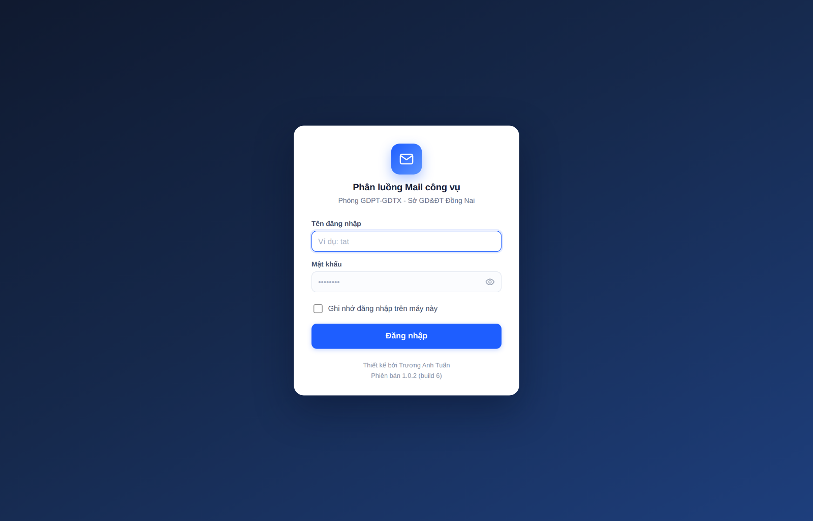

- **Tên đăng nhập** — do quản trị cấp, thường là mã viết tắt của bạn (ví dụ `tat`)
- **Mật khẩu** — lần đầu quản trị cấp, bạn nên đổi ngay
- **Ghi nhớ đăng nhập trên máy này** — chỉ tích khi dùng máy riêng của mình

Bấm biểu tượng con mắt bên phải ô mật khẩu để xem lại mật khẩu vừa gõ, phòng khi gõ nhầm.

> **Lưu ý an toàn:** không tích "Ghi nhớ đăng nhập" trên máy dùng chung. Xong việc nhớ bấm
> đăng xuất ở góc dưới bên trái.

---

## 3. Hộp việc của tôi

Đây là màn hình bạn dùng nhiều nhất. Nó chỉ hiện những văn bản được giao cho **riêng bạn** —
không thấy việc của người khác, và người khác cũng không thấy việc của bạn.

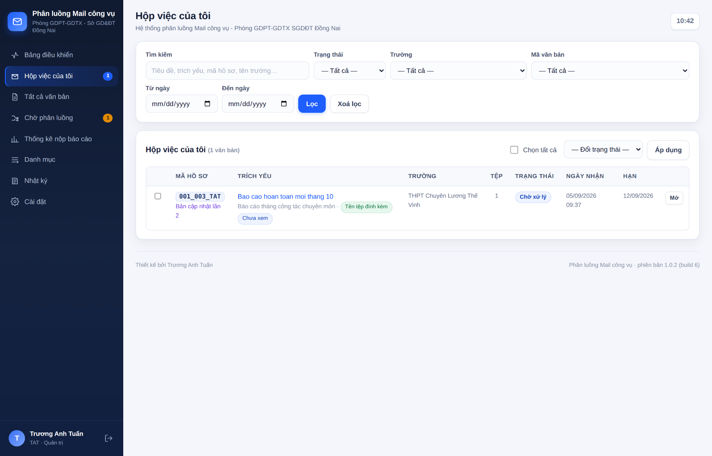

Mỗi dòng cho biết:

| Cột | Ý nghĩa |
|---|---|
| **Trường** | Trường nào gửi |
| **Văn bản** | Loại báo cáo / công việc |
| **Tiêu đề** | Tiêu đề bức thư gốc |
| **Tệp** | Số tệp đính kèm |
| **Ngày nhận** | Giờ Việt Nam |
| **Trạng thái** | Chờ xử lý · Đang xử lý · Đã xử lý |

Con số màu cam cạnh chữ *"Hộp việc của tôi"* ở thanh bên trái là **số việc chưa xử lý**.
Nhìn con số đó là biết ngay còn bao nhiêu việc đang chờ.

Dùng thanh lọc phía trên để tìm nhanh theo trường, theo loại văn bản, theo trạng thái, hoặc
theo khoảng ngày.

---

## 4. Xem và tải văn bản

Bấm vào một dòng bất kỳ để mở trang chi tiết:

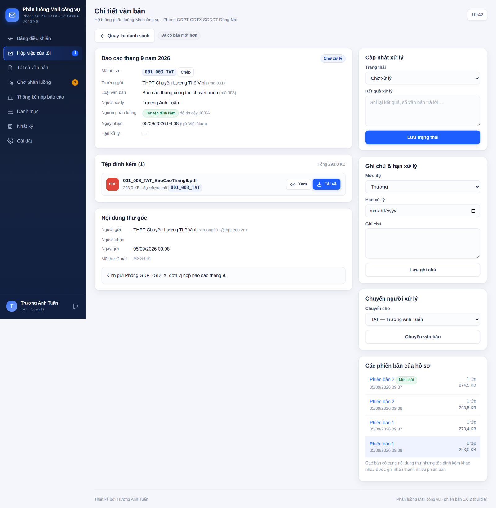

Trang này có đủ mọi thứ về bức thư:

- **Thông tin chung** — trường, mã văn bản, người gửi, ngày nhận, người xử lý
- **Nội dung thư gốc** — nguyên văn, không bị cắt xén
- **Danh sách tệp đính kèm** — mỗi tệp có hai nút:
  - **Xem** — mở ngay trong trình duyệt (dùng được với PDF, ảnh, văn bản)
  - **Tải về** — lưu tệp xuống máy

Xử lý xong, bấm nút **Đánh dấu đã xử lý**. Muốn ghi lại điều gì cho người sau đọc thì gõ vào
ô ghi chú trước khi bấm.

> **Nếu thấy nhãn "Bản cập nhật lần 2"** thì nghĩa là trường đã sửa tệp rồi gửi lại. Hệ thống
> hiển thị bản mới nhất trước, nhưng bản cũ vẫn còn nguyên để bạn đối chiếu khi cần.

---

## 5. Đổi mật khẩu và thông tin cá nhân

Bấm vào tên bạn ở góc dưới bên trái để vào trang hồ sơ:

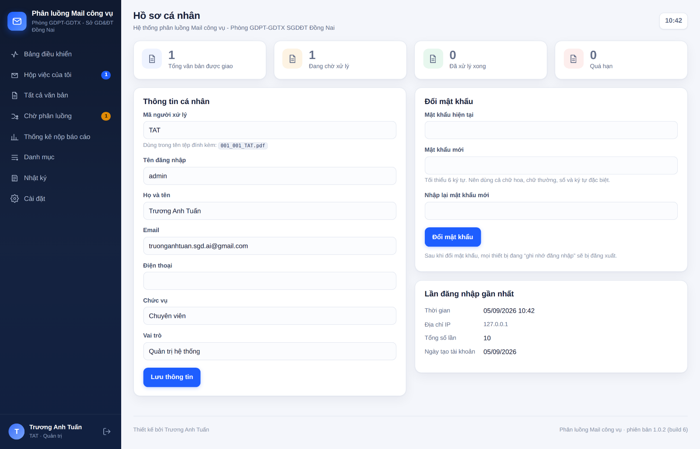

Ở đây bạn:

- Xem **mã người xử lý** của mình — chính là ba chữ cuối trong tên tệp mà các trường phải gõ
- Xem **bí danh khác** — các cách viết tắt khác mà hệ thống cũng nhận cho bạn
- Sửa họ tên, email, điện thoại, chức vụ
- **Đổi mật khẩu** — nên dùng ít nhất 6 ký tự, có cả chữ hoa, chữ thường, số và ký tự đặc biệt

---

# Phần B — Dành cho quản trị

## 6. Bảng điều khiển

Đăng nhập bằng tài khoản quản trị, màn hình đầu tiên là bảng điều khiển:

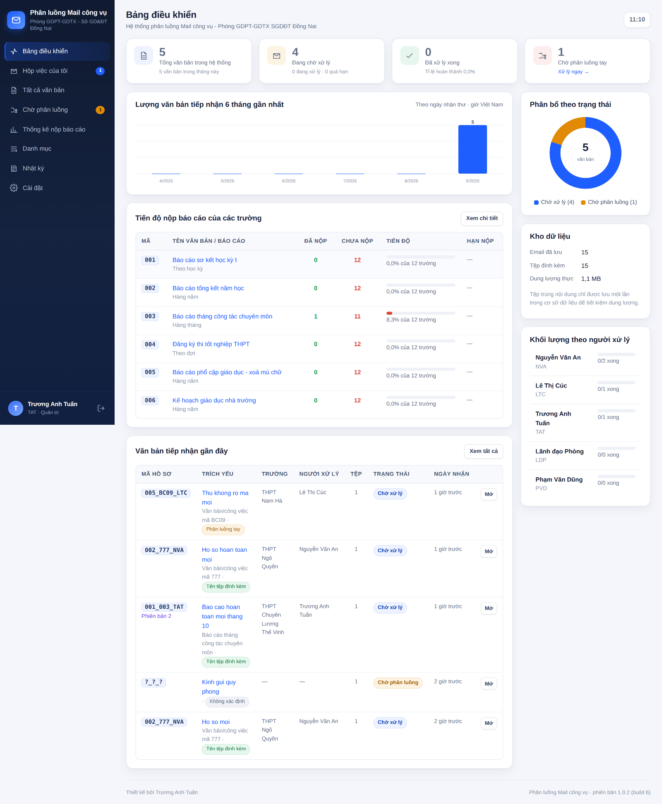

Bốn thẻ trên cùng cho biết nhanh: tổng số văn bản, số việc đang chờ xử lý, số việc chờ phân
luồng tay, và số trường đã nộp trong kỳ.

Bên dưới là biểu đồ tròn phân bố theo trạng thái, biểu đồ cột theo từng người xử lý, và danh
sách văn bản mới nhận gần nhất.

**Việc nên làm mỗi ngày:** nhìn con số *"Chờ phân luồng"*. Nếu lớn hơn 0 thì vào xử lý ngay,
vì những việc đó chưa được tính vào thống kê nộp báo cáo.

---

## 7. Chờ phân luồng tay

Đây là nơi chứa những bức thư mà hệ thống không đọc được mã — thường vì trường đặt tên tệp
không theo quy ước.

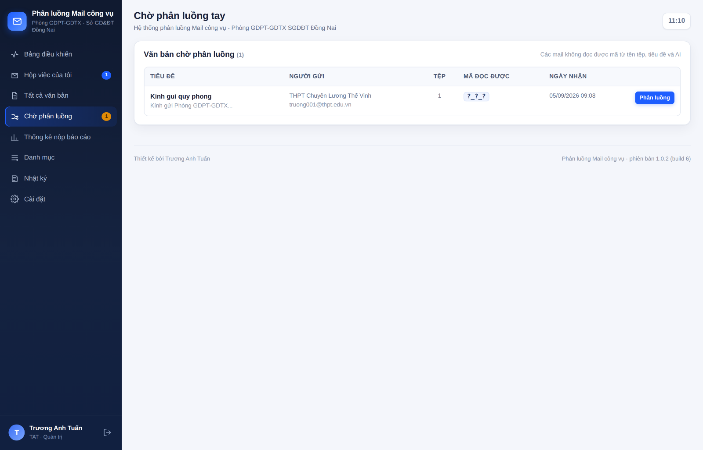

Bấm nút **Phân luồng** ở cuối dòng để mở biểu mẫu:

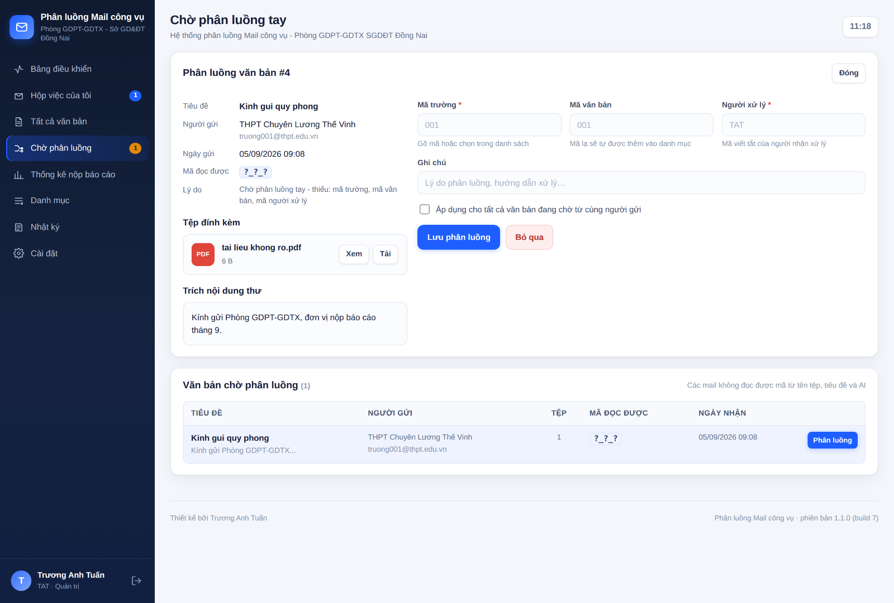

Bên trái là nội dung thư và danh sách tệp đính kèm để bạn xem trước khi quyết định; bên phải là
ba ô cần điền:

| Ô | Bắt buộc | Cách điền |
|---|---|---|
| **Mã trường** | Có | Gõ mã, hoặc bấm mũi tên chọn trong danh sách |
| **Mã văn bản** | Không | Mã lạ sẽ tự được thêm vào danh mục |
| **Người xử lý** | Có | Mã viết tắt của cán bộ nhận việc |

Có thêm hai lựa chọn hữu ích:

- **Nhờ AI đọc giúp** — nếu quản trị đã bật trợ lý AI, bấm nút này để AI đọc thử và điền sẵn
  vào ba ô. Bạn vẫn kiểm tra lại rồi mới lưu.
- **Áp dụng cho tất cả văn bản đang chờ từ cùng người gửi** — tích ô này khi một trường gửi
  nhiều mail cùng kiểu; bạn chỉ phải điền một lần.

Bấm **Lưu phân luồng** là xong. Văn bản lập tức xuất hiện trong hộp việc của người được chọn.

Nếu đó là thư rác hoặc thư không liên quan, bấm **Bỏ qua**.

---

## 8. Thống kê nộp báo cáo

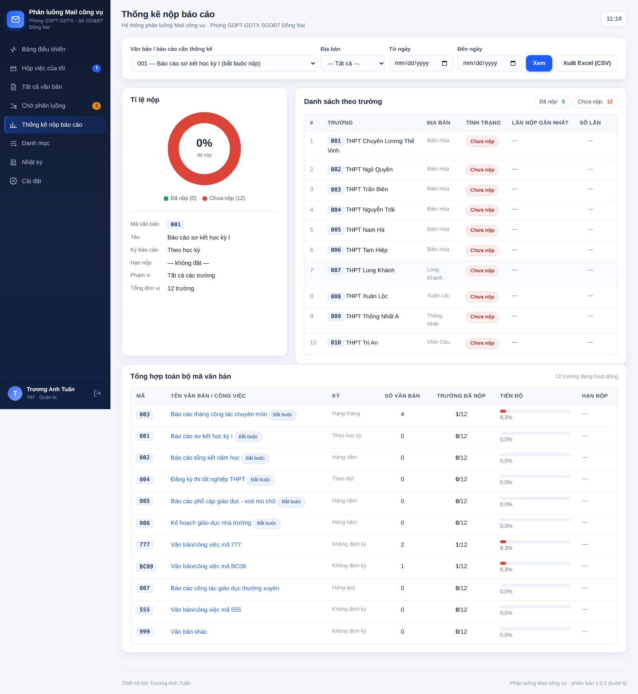

Chọn loại văn bản cần theo dõi, chọn khoảng thời gian, bấm **Xem**. Hệ thống liệt kê rõ:

- **Trường đã nộp** — kèm ngày nộp và người xử lý
- **Trường chưa nộp** — danh sách để nhắc

Bấm **Xuất CSV** để tải danh sách về, mở bằng Excel rồi gửi công văn nhắc nhở.

> **Cần nhớ:** trường được tính là "đã nộp" ngay khi văn bản vào hệ thống, không phải đợi cán
> bộ xử lý xong. Vì vậy hãy dọn sạch hàng chờ phân luồng trước khi chốt số liệu.

---

## 9. Quản lý danh mục

Hệ thống có ba danh mục, chuyển qua lại bằng ba nút ở đầu trang.

### 9.1. Danh mục trường

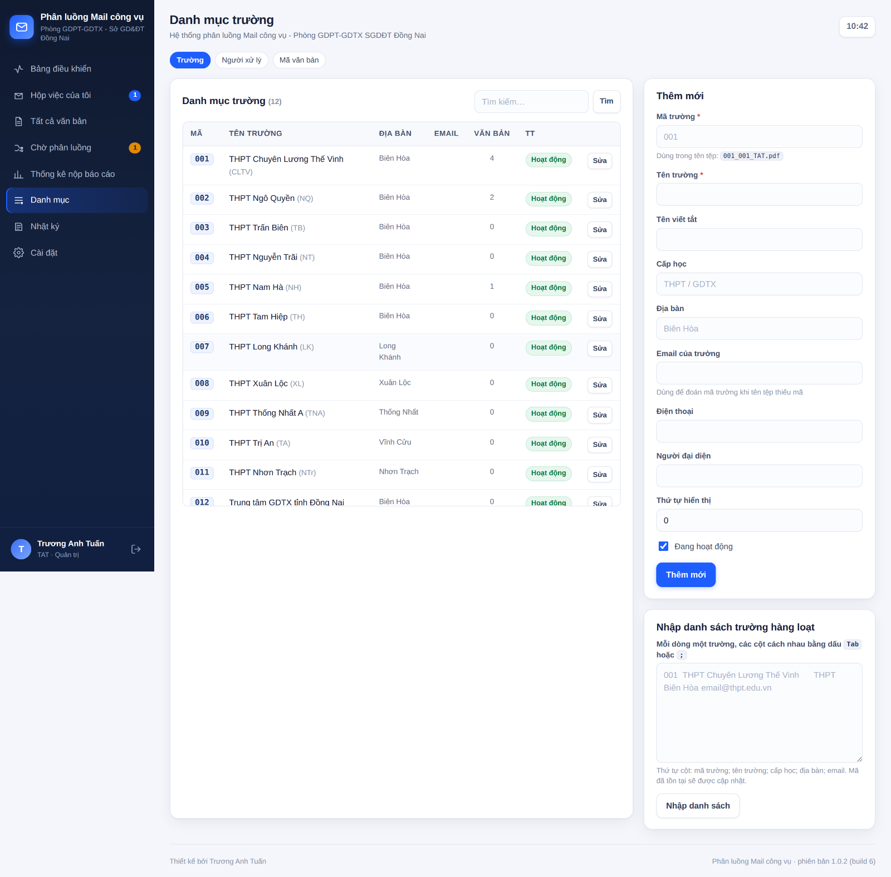

Đây là danh mục **bắt buộc** — không có mã trường trong danh mục thì hệ thống không phân
luồng tự động được.

| Trường thông tin | Ghi chú |
|---|---|
| **Mã trường** | Phần đầu trong tên tệp. Nên dùng 3 chữ số: `001`, `002`… |
| **Tên trường** | Tên đầy đủ |
| Tên viết tắt | Hiện gọn trong bảng danh sách |
| Cấp học, địa bàn | Dùng để lọc trong thống kê |
| **Email của trường** | Rất nên điền — giúp đoán mã trường khi tên tệp thiếu mã |

Khi mới triển khai, dùng ô **Nhập danh sách trường hàng loạt** ở cột phải: chép từ Excel dán
thẳng vào, mỗi dòng một trường, các cột cách nhau bằng `Tab`. Thứ tự cột là *mã trường; tên
trường; cấp học; địa bàn; email*. Mã đã tồn tại sẽ được cập nhật chứ không bị nhân đôi.

### 9.2. Danh mục người xử lý

Đây vừa là danh mục cán bộ, vừa là nơi tạo tài khoản đăng nhập.

| Trường thông tin | Ghi chú |
|---|---|
| **Mã người xử lý** | Phần cuối trong tên tệp, ví dụ `TAT` |
| **Bí danh khác** | Các cách viết tắt khác, cách nhau bằng dấu phẩy |
| **Họ và tên** | |
| **Tên đăng nhập** | Dùng để đăng nhập web |
| **Mật khẩu** | Để trống khi sửa nghĩa là giữ mật khẩu cũ |
| **Vai trò** | Người xử lý · Quản trị · Lãnh đạo |

Ô **Bí danh khác** rất đáng dùng. Nếu các trường hay gõ nhầm `T.A.TUAN`, `TUAN`, `TATUAN`
thay vì `TAT`, cứ thêm hết vào bí danh — hệ thống sẽ nhận tất.

### 9.3. Danh mục mã văn bản

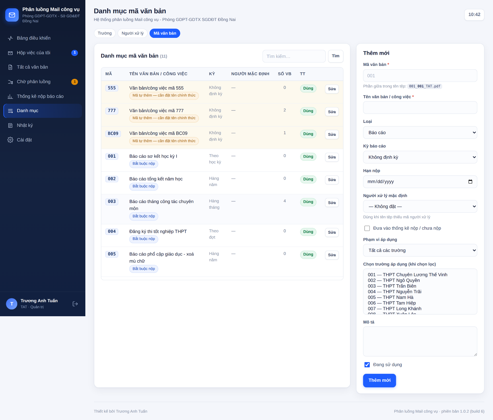

Đây là danh mục **được nới lỏng có chủ ý**. Những dòng có nền vàng và nhãn *"Mã tự thêm —
cần đặt tên chính thức"* là mã mà hệ thống gặp trong thực tế nhưng chưa có trong danh mục.

Nó vẫn hiện, vẫn được đếm vào thống kê, chỉ chờ bạn bấm **Sửa** rồi đặt tên chính thức.

Các thiết lập đáng chú ý:

- **Kỳ báo cáo** — hàng tháng, hàng quý, theo học kỳ, hàng năm, theo đợt…
- **Hạn nộp** — dùng để tô đỏ những trường nộp muộn
- **Người xử lý mặc định** — dùng khi tên tệp thiếu phần mã người xử lý
- **Đưa vào thống kê nộp / chưa nộp** — chỉ tích với những văn bản mà **mọi trường đều phải nộp**
- **Phạm vi áp dụng** — *Tất cả các trường*, hoặc *Chỉ một số trường* rồi chọn danh sách cụ thể

---

## 10. Nhật ký hệ thống

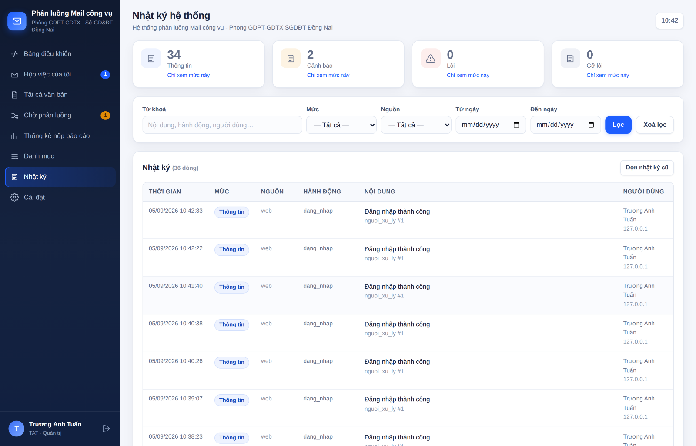

Mọi việc hệ thống làm đều được ghi lại: ai đăng nhập lúc nào, bộ nhận mail chạy phiên nào,
văn bản nào được phân luồng cho ai, ai sửa danh mục.

Bốn thẻ trên cùng đếm số dòng theo từng mức: **Thông tin**, **Cảnh báo**, **Lỗi**, **Gỡ lỗi**.
Bấm *"Chỉ xem mức này"* để lọc nhanh.

Khi có sự cố, cách tra nhanh nhất là bấm vào thẻ **Lỗi** rồi đọc từ trên xuống.

Bấm **Dọn nhật ký cũ** để xoá các dòng cũ hơn số ngày đã cấu hình trong Cài đặt.

---

## 11. Cài đặt hệ thống

Trang Cài đặt chia thành sáu nhóm.

### 11.1. Giao diện & thương hiệu

Đổi tên ứng dụng, tên đơn vị, dòng bản quyền ở chân trang, màu chủ đạo, và đường dẫn logo.

Mặc định:

- Tên ứng dụng: *Hệ thống phân luồng Mail công vụ - Phòng GDPT-GDTX SGDĐT Đồng Nai*
- Bản quyền: *Thiết kế bởi Trương Anh Tuấn*

### 11.2. Quy tắc phân luồng

- **Tự thêm mã văn bản lạ vào danh mục (nới lỏng)** — nên để bật
- **Bắt buộc mã trường phải có trong danh mục** — nên để bật, tránh phân luồng nhầm
- **Người xử lý mặc định** — mã của người nhận các mail không xác định được. Để trống nghĩa là
  đưa vào hàng chờ phân luồng tay
- **Ký tự ngăn cách chấp nhận** — mặc định nhận cả `_`, `-`, `.` và khoảng trắng

### 11.3. Chống trùng lặp

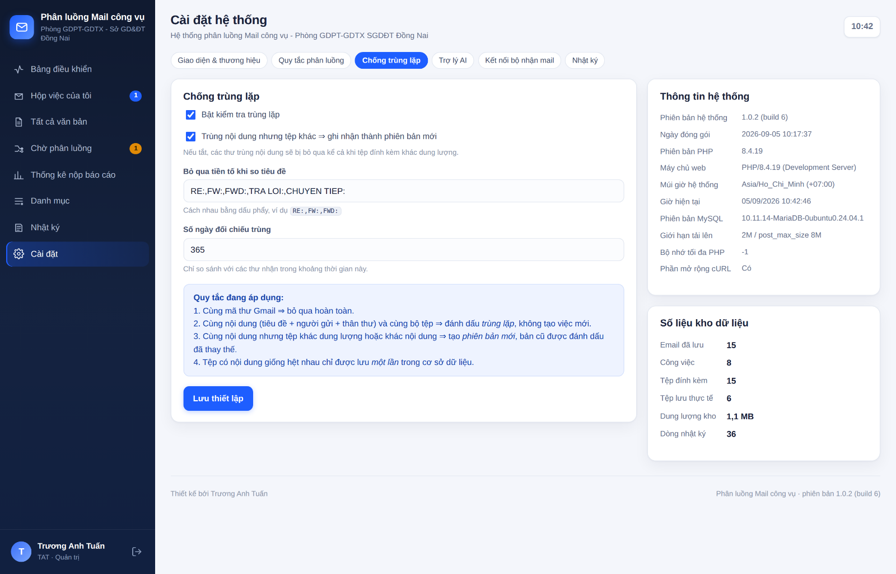

- **Tiền tố bỏ qua khi so tiêu đề** — mặc định `RE:,FW:,FWD:`
- **Khoảng thời gian so trùng** — chỉ so với thư nhận trong khoảng này, để tránh phải quét
  toàn bộ lịch sử

### 11.4. Trợ lý AI

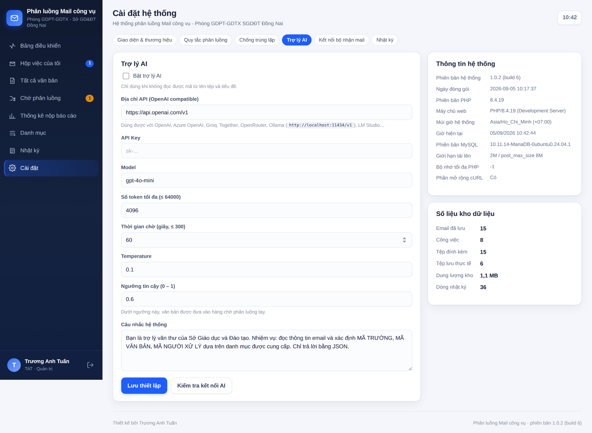

Xem chi tiết ở [mục 9 của tài liệu kỹ thuật](QUY-TRINH-KY-THUAT.md#9-trợ-lý-ai).
Sau khi điền, bấm **Kiểm tra kết nối AI** để thử ngay.

### 11.5. Kết nối bộ nhận mail

Nơi lấy **khoá API** để dán vào bộ nhận mail khi chạy ở chế độ *Qua API PHP*. Cũng đặt được
kích thước mỗi khối tải lên — giảm xuống nếu hosting giới hạn `post_max_size` nhỏ.

### 11.6. Nhật ký

Chọn mức ghi tối thiểu và số ngày giữ nhật ký. Đặt 0 ngày để giữ mãi.

---

# Phần C — Vận hành bộ nhận mail

## 12. Khởi động bộ nhận mail

Bộ nhận mail chạy trên **máy nhà hoặc VPS**, không chạy trên hosting.

**Trên Windows:** giải nén tệp zip, nhấp đúp `mailrouter.exe`. Trình duyệt tự mở giao diện
điều khiển.

**Trên Linux:**

```bash
tar -xzf mailrouter-linux-x64-v1.0.2.tar.gz
cd mailrouter-linux-x64
./mailrouter giao-dien
```

Rồi mở trình duyệt vào `http://127.0.0.1:8899`.

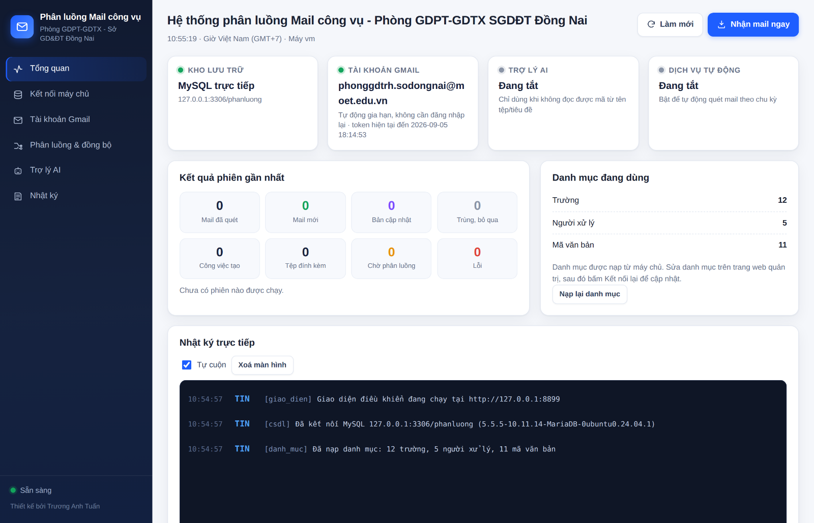

Màn hình Tổng quan cho biết ngay bốn điều: kho lưu trữ đã kết nối chưa, Gmail đã đăng nhập
chưa, trợ lý AI bật hay tắt, và dịch vụ tự động có đang chạy không. Chấm tròn màu xanh là
tốt, màu xám là chưa bật.

Bảng **Nhật ký trực tiếp** ở dưới cùng chạy theo thời gian thực — rất tiện để theo dõi khi
đang đồng bộ.

---

## 13. Kết nối máy chủ

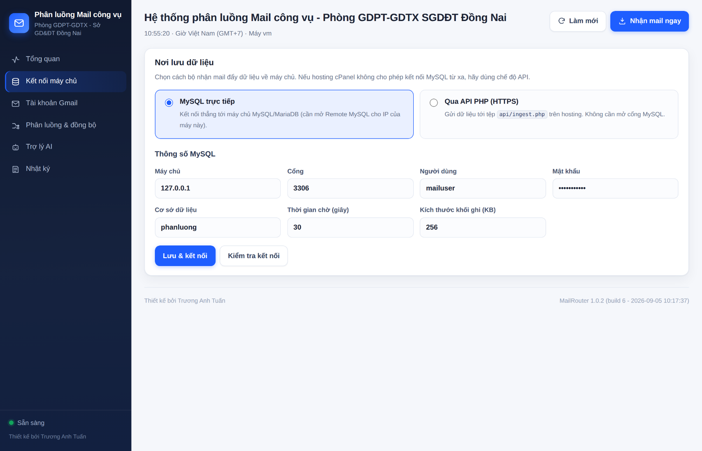

Chọn một trong hai cách:

**Cách A — MySQL trực tiếp.** Điền máy chủ, cổng, tên đăng nhập, mật khẩu, tên cơ sở dữ liệu
đúng như cPanel cấp. Nhớ vào cPanel → *MySQL Databases* → *Remote MySQL* thêm IP máy của bạn
vào danh sách cho phép.

**Cách B — Qua API PHP.** Điền địa chỉ web và khoá API lấy từ *Cài đặt → Kết nối bộ nhận mail*
của trang web. Cách này **dễ hơn nhiều** với hosting phổ thông và với đường truyền IP động ở
nhà.

Bấm **Kiểm tra kết nối** để thử trước khi lưu.

> **Gặp lỗi `Table ... doesn't exist`?** Nghĩa là kết nối đã thông nhưng cơ sở dữ liệu còn
> rỗng. Hãy chạy `cai-dat.php` trên hosting trước để tạo bảng. Xem [mục 17](#17-xử-lý-sự-cố-thường-gặp).

---

## 14. Đăng nhập Gmail

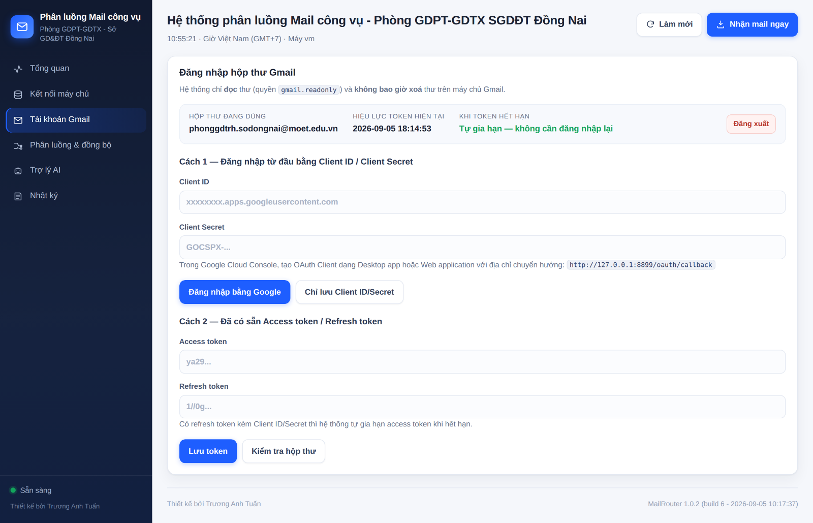

Hai cách, chọn cách nào cũng được:

**Cách 1 — Có Client ID.** Dán Client ID và Client Secret lấy từ Google Cloud Console
(xem [hướng dẫn lấy](GMAIL-OAUTH.md)), bấm **Đăng nhập Google**. Trình duyệt mở trang cấp
quyền của Google, bạn chọn hộp thư công vụ và bấm đồng ý. Xong.

**Cách 2 — Đã có sẵn token.** Dán thẳng `access_token` và `refresh_token` vào, bấm lưu.

### Hết hạn có phải đăng nhập lại không?

**Không**, miễn là có refresh token. Hãy nhìn dòng **Gia hạn** trên màn hình:

- Chữ **xanh** *"Tự gia hạn — không cần đăng nhập lại"* → yên tâm, hệ thống tự lo
- Chữ **đỏ** *"Phải đăng nhập lại (thiếu refresh token)"* → nên đăng nhập lại bằng Cách 1 để
  lấy refresh token

Access token của Google chỉ sống khoảng một giờ, nhưng hệ thống tự đổi lấy token mới trước
khi hết hạn, và lưu lại vào tệp cấu hình. Bạn không phải làm gì cả.

---

## 15. Chạy đồng bộ và hẹn giờ tự động

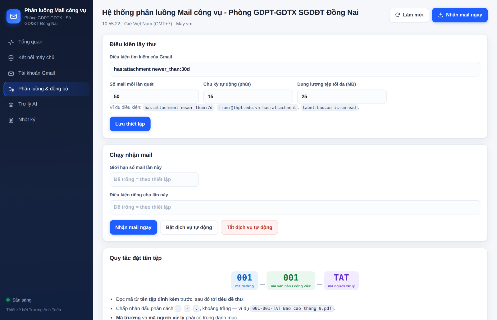

**Chạy thủ công:** bấm nút **Nhận mail ngay** ở góc trên bên phải. Theo dõi tiến trình ở bảng
nhật ký trực tiếp.

**Chạy tự động:** bật *Dịch vụ tự động* và đặt chu kỳ (ví dụ 15 phút). Bộ nhận mail sẽ tự
quét theo chu kỳ đó, chỉ cần để cửa sổ chạy nền.

**Truy vấn Gmail** mặc định là `has:attachment newer_than:30d` — chỉ lấy thư có tệp đính kèm
trong 30 ngày gần nhất. Sửa được nếu cần, dùng đúng cú pháp tìm kiếm của Gmail.

**Quét cả hộp Thư rác (Spam)** — nên để bật. Google hay xếp nhầm báo cáo của các trường vào
Thư rác; tắt mục này là bỏ sót, và thống kê sẽ báo *"chưa nộp"* oan cho trường đã gửi. Thư
trong **Thùng rác** thì hệ thống luôn bỏ qua, vì đó là thư ai đó đã chủ động xoá.

Thư vớt được từ Thư rác hiện huy hiệu vàng **"Hộp Thư rác"** ở trang chi tiết và trang phân
luồng tay, và được đếm riêng trong kết quả mỗi phiên.

> **Lưu ý khi đặt điều kiện lọc:** nếu bạn lọc theo nhãn tự đặt (ví dụ `label:baocao`) thì
> phần quét Thư rác gần như không tìm được gì, vì Gmail không gắn nhãn của bạn cho thư đã bị
> xếp vào Thư rác. Nên lọc theo `has:attachment` hoặc theo người gửi thì hơn.

Kết thúc mỗi phiên, hệ thống báo lại tám con số: mail đã quét, mail mới, bản cập nhật, trùng
bị bỏ qua, công việc tạo, tệp đính kèm, chờ phân luồng, và lỗi.

### Chạy nền như một dịch vụ

**Trên Linux** — dùng tệp `mailrouter.service` có sẵn trong gói:

```bash
sudo cp mailrouter.service /etc/systemd/system/
sudo systemctl enable --now mailrouter
```

**Trên Windows** — dùng Task Scheduler, đặt lệnh chạy `mailrouter.exe dich-vu` lúc khởi động
máy.

---

# Phần D — Hướng dẫn cho các trường

## 16. Cách đặt tên tệp khi gửi báo cáo

*Phần này nên trích ra gửi kèm công văn hướng dẫn cho các trường.*

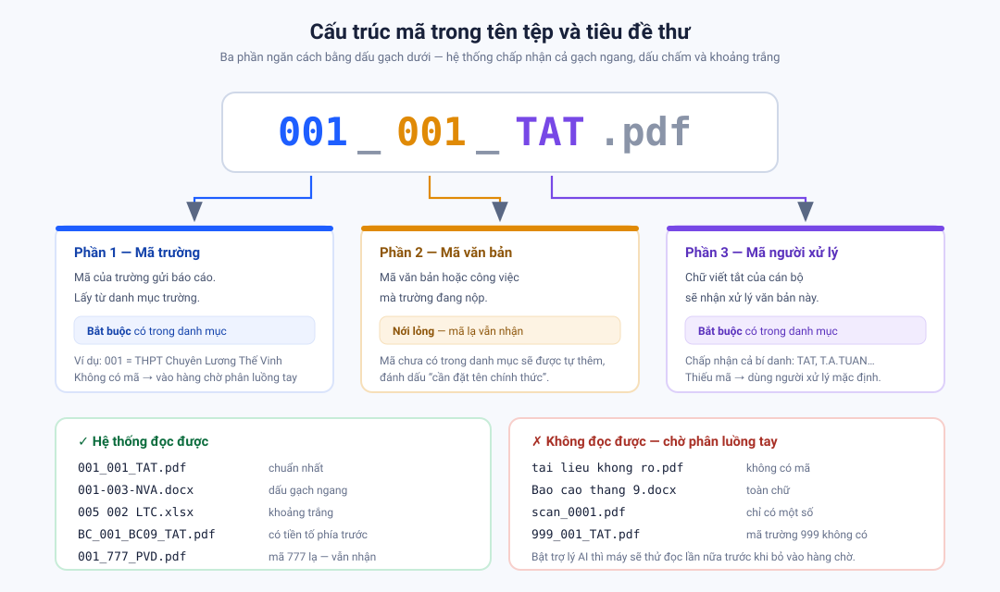

Khi gửi báo cáo về Phòng, hãy đặt **tên tệp đính kèm** theo mẫu:

```
<mã trường>_<mã văn bản>_<mã người xử lý>.<đuôi tệp>
```

Ví dụ: `001_003_TAT.pdf` nghĩa là trường `001` nộp văn bản `003`, chuyển cho cán bộ `TAT`.

**Ba điều cần nhớ:**

1. **Mã trường** — tra trong công văn hướng dẫn của Phòng, hoặc hỏi văn thư
2. **Mã văn bản** — ghi trong công văn yêu cầu báo cáo
3. **Mã người xử lý** — ghi trong công văn yêu cầu báo cáo

**Được chấp nhận:**

| Tên tệp | Vì sao được |
|---|---|
| `001_001_TAT.pdf` | Chuẩn nhất |
| `001-003-NVA.docx` | Dùng dấu gạch ngang cũng được |
| `005 002 LTC.xlsx` | Dùng khoảng trắng cũng được |
| `BC_001_BC09_TAT.pdf` | Có chữ phía trước vẫn được |

**Không đọc được — sẽ chậm vì phải chuyển tay:**

| Tên tệp | Vì sao không được |
|---|---|
| `tai lieu khong ro.pdf` | Không có mã nào |
| `Bao cao thang 9.docx` | Toàn chữ |
| `scan_0001.pdf` | Chỉ có một con số |
| `999_001_TAT.pdf` | Mã trường `999` không có trong danh mục |

**Nếu không đặt tên tệp được** (ví dụ gửi từ điện thoại), hãy ghi mã vào **tiêu đề thư** —
hệ thống cũng đọc được từ đó.

**Gửi nhầm rồi gửi lại có sao không?** Không sao cả. Gửi lại y hệt thì hệ thống nhận ra và bỏ
qua. Sửa tệp rồi gửi lại thì hệ thống lưu thành bản cập nhật, cán bộ sẽ thấy bản mới nhất.

---

# Phần E

## 17. Xử lý sự cố thường gặp

| Hiện tượng | Nguyên nhân | Cách xử lý |
|---|---|---|
| `Table '...cau_hinh' doesn't exist` | Chưa chạy trình cài đặt, CSDL còn rỗng | Mở `https://tên-miền/cai-dat.php` chạy hết 4 bước, rồi **xoá tệp `cai-dat.php`** đi |
| `Cơ sở dữ liệu được tạo từ phiên bản cũ, còn thiếu … cột` | Nâng cấp mã nguồn nhưng chưa nâng cấp CSDL | Mở `https://tên-miền/nang-cap.php`, bấm **Nâng cấp ngay**, rồi **xoá tệp `nang-cap.php`** đi. Dữ liệu cũ giữ nguyên |
| Trường khẳng định đã gửi mà hệ thống không thấy | Thư rơi vào Thư rác, hoặc mục *Quét cả hộp Thư rác* đang tắt | Bật lại mục đó trong *Phân luồng & đồng bộ*, chạy đồng bộ lại; sau đó tạo bộ lọc Gmail “không bao giờ chuyển vào Thư rác” cho tên miền các trường |
| `Access denied for user` | Sai tài khoản MySQL, hoặc chưa mở Remote MySQL | Kiểm tra lại thông tin trong cPanel; hoặc chuyển sang chế độ *Qua API PHP* |
| Kết nối MySQL bị từ chối từ máy nhà | Hosting chặn MySQL từ xa, hoặc IP nhà đã đổi | Chuyển sang chế độ *Qua API PHP* — cách này không phụ thuộc IP |
| Dòng "Gia hạn" hiện chữ đỏ | Chỉ có access token, thiếu refresh token | Đăng nhập lại bằng Client ID để lấy refresh token |
| Đồng bộ báo `401` liên tục | Token bị thu hồi, hoặc đổi mật khẩu Gmail | Đăng nhập lại Gmail trong bộ nhận mail |
| Nhiều mail vào hàng chờ phân luồng | Các trường đặt tên tệp sai quy ước | Gửi lại hướng dẫn ở [mục 16](#16-cách-đặt-tên-tệp-khi-gửi-báo-cáo); cân nhắc bật trợ lý AI |
| Tải tệp lớn bị lỗi giữa chừng | `post_max_size` của hosting nhỏ | Giảm kích thước khối trong *Cài đặt → Kết nối bộ nhận mail* |
| Thống kê thiếu trường | Còn việc kẹt ở hàng chờ phân luồng | Dọn hết hàng chờ rồi xem lại |
| Giao diện hiển thị sai sau khi nâng cấp | Trình duyệt còn giữ tệp CSS cũ | Không cần làm gì — số phiên bản nằm trong đường dẫn CSS nên trình duyệt tự tải mới |

Khi không rõ nguyên nhân, vào **Nhật ký hệ thống**, bấm thẻ **Lỗi**, đọc dòng mới nhất.

---

## 18. Câu hỏi thường gặp

**Hệ thống có xoá mail trong hộp thư không?**
Không. Hệ thống chỉ xin quyền đọc (`gmail.readonly`), Google sẽ từ chối mọi lệnh xoá hoặc
sửa nhãn. Hộp thư công vụ nguyên vẹn.

**Trường có gửi mà thư rơi vào Thư rác thì sao?**
Hệ thống **vẫn lấy được**. Mỗi phiên đồng bộ quét hai lượt: hộp thư chính rồi tới hộp Thư
rác. Thư vớt được hiện huy hiệu vàng *"Hộp Thư rác"* để bạn biết.

Nhưng nên xử lý tận gốc, đừng để lặp lại: vào Gmail → *Cài đặt → Bộ lọc và địa chỉ bị chặn
→ Tạo bộ lọc mới*, ô **Từ** điền tên miền của các trường (ví dụ `@thpt.edu.vn`), bấm *Tạo bộ
lọc*, rồi tích **“Không bao giờ chuyển vào Thư rác”**. Dùng Google Workspace thì quản trị
viên làm một lần cho cả cơ quan ở *Admin console → Apps → Gmail → Spam, Phishing and Malware
→ Allowlist*.

**Thư đã xoá vào Thùng rác có bị lấy lại không?**
Không. Thùng rác luôn được bỏ qua — đã chủ động xoá thì hệ thống tôn trọng quyết định đó.

**Bộ nhận mail phải bật 24/24 không?**
Không bắt buộc. Tắt máy vài ngày rồi bật lại, hệ thống sẽ lấy bù những mail chưa đọc (trong
phạm vi truy vấn Gmail — mặc định là 30 ngày gần nhất).

**Một mail kèm nhiều tệp của nhiều trường thì sao?**
Hệ thống đọc mã trên **từng tệp**, nên sẽ tạo ra nhiều công việc riêng cho nhiều người xử lý
riêng. Đây là tình huống đã được tính tới.

**Cùng một công văn được 12 trường gửi kèm lại thì có tốn 12 lần dung lượng không?**
Không. Tệp có nội dung giống hệt nhau chỉ được lưu **một bản** trong cơ sở dữ liệu, dù tên
tệp khác nhau hay do trường khác nhau gửi.

**Không bật trợ lý AI thì có dùng được không?**
Được đầy đủ. AI chỉ là lớp hỗ trợ thêm cho những mail khó đọc; không bật thì các mail đó vào
hàng chờ phân luồng tay để quản trị xử lý.

**Đổi mật khẩu cho người quên mật khẩu thế nào?**
Quản trị vào *Danh mục → Người xử lý*, bấm **Sửa** người đó, gõ mật khẩu mới vào ô Mật khẩu
rồi lưu. Để trống ô đó nghĩa là giữ nguyên mật khẩu cũ.

**Có xem được số liệu trên điện thoại không?**
Được. Giao diện web tự co giãn theo màn hình, dùng tốt trên điện thoại và máy tính bảng.

**Sao lưu dữ liệu thế nào?**
Vào cPanel → *phpMyAdmin* → chọn cơ sở dữ liệu → *Export*. Một tệp `.sql` là đủ **cả dữ liệu
lẫn tệp đính kèm**, vì tệp được lưu ngay trong cơ sở dữ liệu.

---

## Xem thêm

| Tài liệu | Nội dung |
|---|---|
| [Quy trình kỹ thuật](QUY-TRINH-KY-THUAT.md) | Hệ thống hoạt động thế nào ở mức kỹ thuật |
| [Cài đặt web trên cPanel](HUONG-DAN-WEB-CPANEL.md) | Từng bước đưa web lên hosting |
| [Cài đặt bộ nhận mail](HUONG-DAN-BO-NHAN-MAIL.md) | Chạy trên máy nhà / VPS |
| [Lấy Client ID Gmail](GMAIL-OAUTH.md) | Thao tác trên Google Cloud Console |
| [Kiến trúc hệ thống](KIEN-TRUC.md) | Dành cho người sửa mã nguồn |

---

*Hệ thống phân luồng Mail công vụ — Phòng GDPT-GDTX, Sở GD&ĐT Đồng Nai*
*Thiết kế bởi Trương Anh Tuấn*
