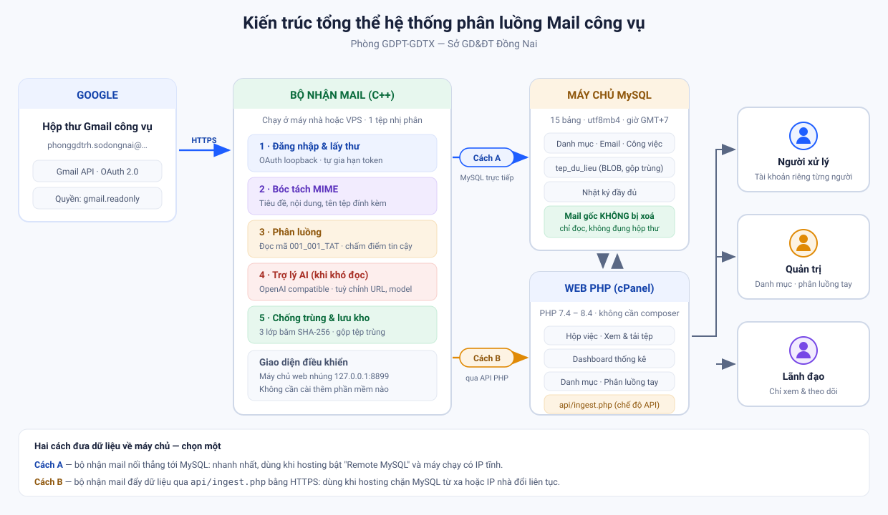
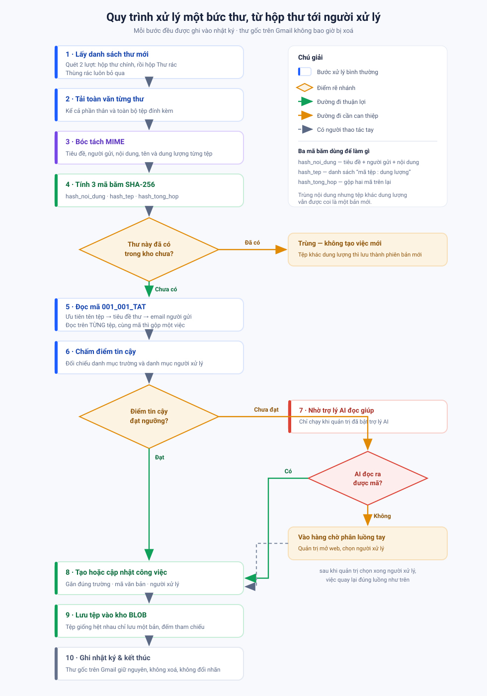
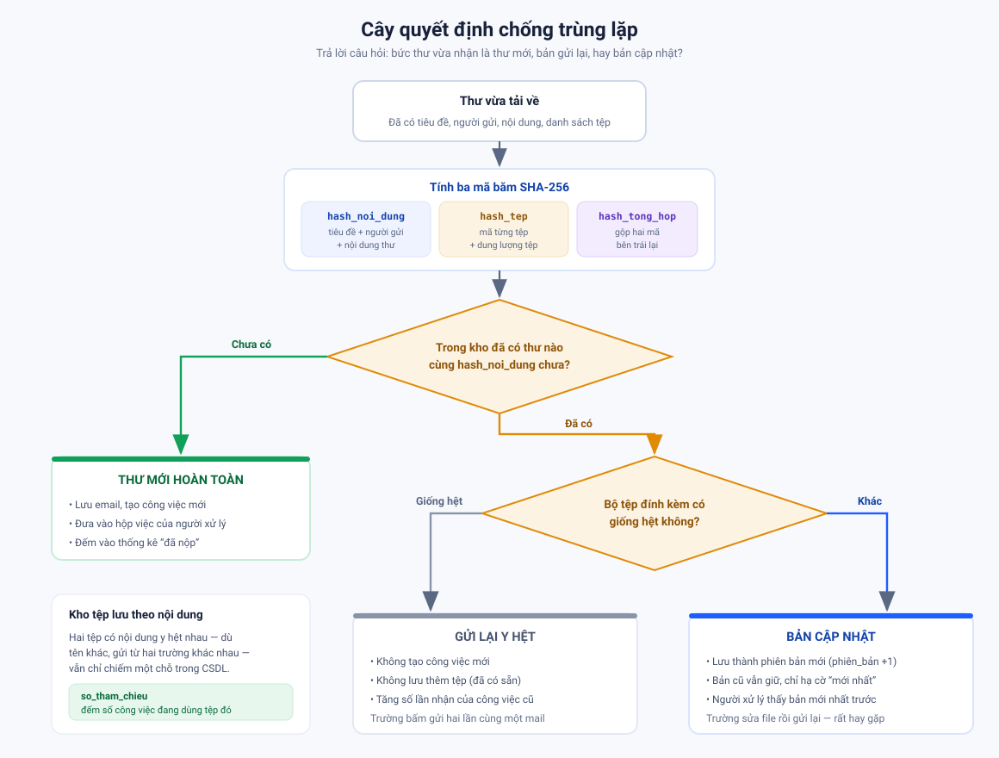
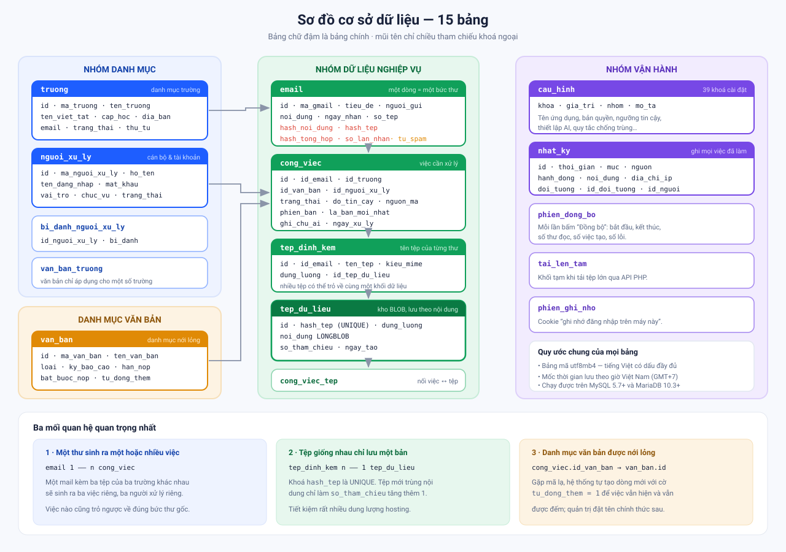
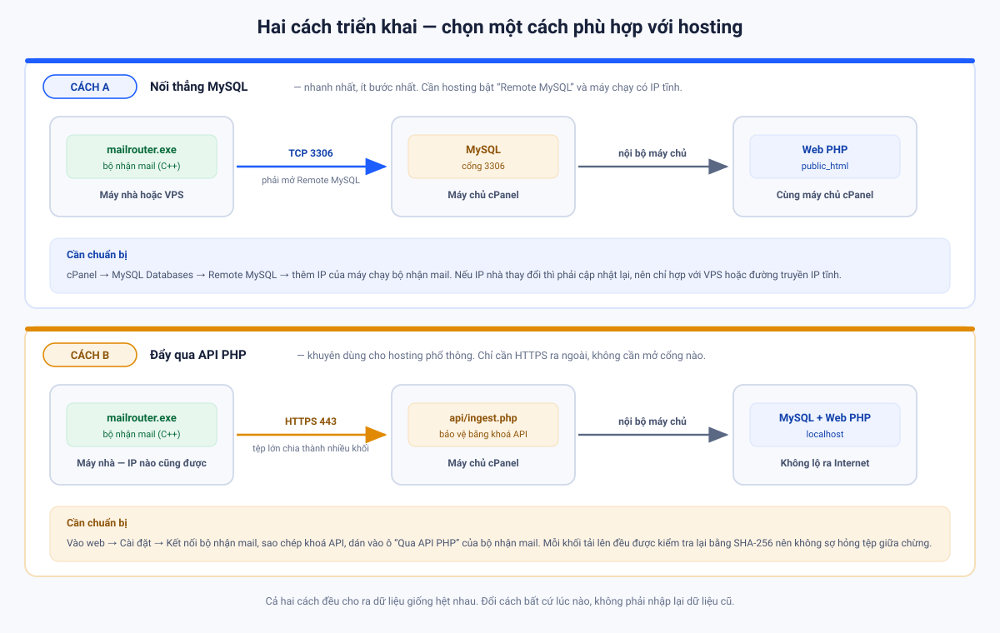
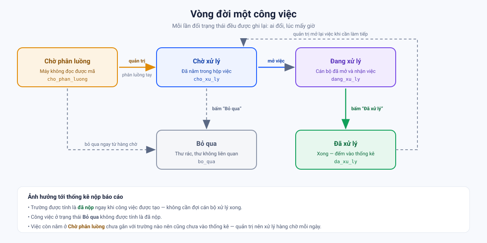
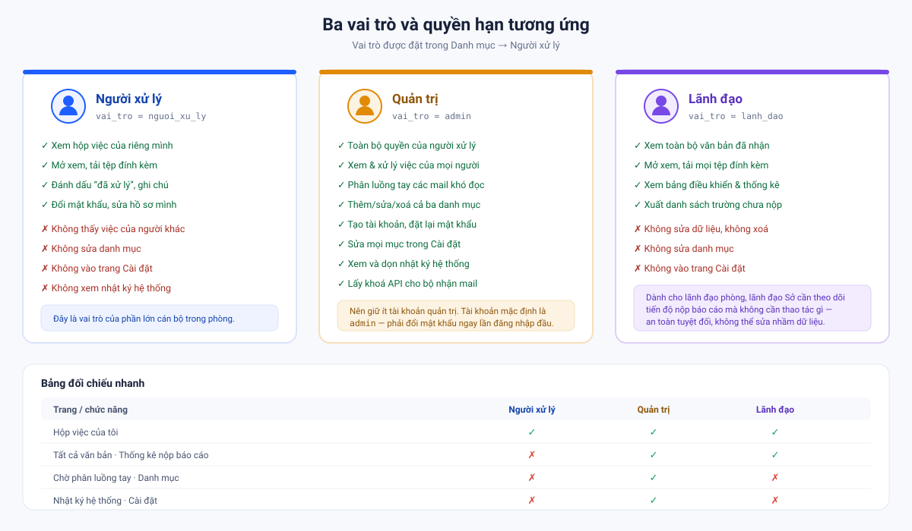
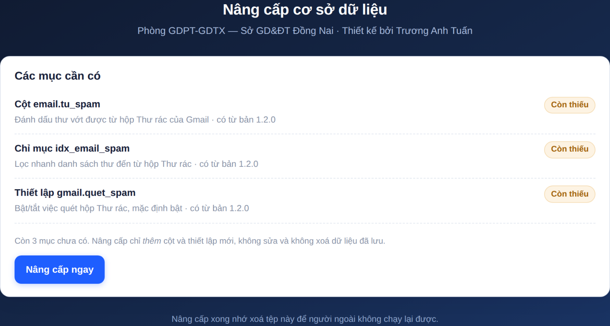

# Quy trình kỹ thuật

**Hệ thống phân luồng Mail công vụ — Phòng GDPT-GDTX, Sở GD&ĐT Đồng Nai**

Tài liệu này mô tả hệ thống làm việc như thế nào ở mức kỹ thuật: dữ liệu đi từ đâu tới đâu,
mỗi bước quyết định điều gì, và vì sao lại thiết kế như vậy. Người đọc nhắm tới là cán bộ
phụ trách công nghệ thông tin, người tiếp nhận bàn giao, hoặc người cần sửa đổi mã nguồn.

> Nếu bạn chỉ cần biết cách dùng hàng ngày, xem [Hướng dẫn sử dụng](HUONG-DAN-SU-DUNG.md).
> Bản PDF in ấn: [Quy trình kỹ thuật & Hướng dẫn sử dụng (PDF)](pdf/He-thong-phan-luong-Mail-cong-vu.pdf).

---

## Mục lục

1. [Kiến trúc tổng thể](#1-kiến-trúc-tổng-thể)
2. [Quy ước mã 001_001_TAT](#2-quy-ước-mã-001_001_tat)
3. [Quy trình xử lý một bức thư](#3-quy-trình-xử-lý-một-bức-thư)
4. [Thuật toán phân luồng và điểm tin cậy](#4-thuật-toán-phân-luồng-và-điểm-tin-cậy)
5. [Cơ chế chống trùng lặp](#5-cơ-chế-chống-trùng-lặp)
6. [Cơ sở dữ liệu](#6-cơ-sở-dữ-liệu)
7. [Hai cách triển khai](#7-hai-cách-triển-khai)
8. [Đăng nhập Gmail và vòng đời token](#8-đăng-nhập-gmail-và-vòng-đời-token)
9. [Trợ lý AI](#9-trợ-lý-ai)
10. [Vòng đời một công việc](#10-vòng-đời-một-công-việc)
11. [Phân quyền](#11-phân-quyền)
12. [Nhật ký và khả năng truy vết](#12-nhật-ký-và-khả-năng-truy-vết)
13. [Những quyết định thiết kế đáng chú ý](#13-những-quyết-định-thiết-kế-đáng-chú-ý)
14. [Quy trình phát hành phiên bản](#14-quy-trình-phát-hành-phiên-bản)
15. [Nâng cấp hệ thống đang chạy](#15-nâng-cấp-hệ-thống-đang-chạy)

---

## 1. Kiến trúc tổng thể

Hệ thống gồm hai phần chạy trên hai máy khác nhau, gặp nhau ở một cơ sở dữ liệu MySQL chung.



| Thành phần | Ngôn ngữ | Chạy ở đâu | Nhiệm vụ |
|---|---|---|---|
| **Bộ nhận mail** | C++17 | Máy nhà hoặc VPS | Đọc Gmail, bóc tách, phân luồng, ghi vào CSDL |
| **Phần web** | PHP 7.4–8.4 | Shared hosting cPanel | Người xử lý xem việc, quản trị điều hành, thống kê |
| **Cơ sở dữ liệu** | MySQL / MariaDB | Cùng máy chủ cPanel | Chứa toàn bộ dữ liệu, kể cả tệp đính kèm dạng BLOB |

Ba nguyên tắc chi phối toàn bộ thiết kế:

**Một là, không phụ thuộc thư viện ngoài.** Bộ nhận mail viết bằng C++ thuần, tự cài đặt lấy
mọi thứ cần dùng: bộ phân tích JSON, mã hoá base64, hàm băm SHA-1 và SHA-256, giao thức
MySQL ở mức gói tin, và một máy chủ HTTP nhỏ để làm giao diện. Nhờ vậy sản phẩm là **một tệp
nhị phân duy nhất**, chép sang máy khác là chạy, không cài đặt gì thêm, không lo xung đột
phiên bản thư viện. Phần web cũng vậy: PHP thuần, không dùng composer, không framework.

**Hai là, thư gốc không bao giờ bị đụng tới.** Hệ thống xin quyền `gmail.readonly` — quyền chỉ
đọc. Google sẽ từ chối mọi lệnh xoá hay sửa nhãn kể cả khi mã nguồn có lỗi. Hộp thư công vụ
vẫn nguyên vẹn để đối chiếu về sau.

**Ba là, mọi việc đều ghi nhật ký.** Từ lúc kết nối máy chủ, đọc từng bức thư, đến lúc một
cán bộ bấm nút "Đã xử lý" — đều có dòng nhật ký ghi lại thời điểm, nguồn, và người thực hiện.

---

## 2. Quy ước mã `001_001_TAT`

Đây là hạt nhân của toàn bộ hệ thống. Trường gửi báo cáo đặt tên tệp đính kèm (hoặc tiêu đề
thư) theo đúng quy ước ba phần, hệ thống đọc ra và biết ngay phải chuyển cho ai.


Ba phần được đối xử **khác nhau một cách có chủ ý**:

| Phần | Ý nghĩa | Mức chặt chẽ | Xử lý khi thiếu / sai |
|---|---|---|---|
| Thứ nhất | Mã trường | **Bắt buộc** có trong danh mục | Thử đoán qua email người gửi; không được thì đưa vào hàng chờ |
| Thứ hai | Mã văn bản / công việc | **Nới lỏng** | Mã lạ vẫn nhận, tự thêm vào danh mục với cờ "cần đặt tên chính thức" |
| Thứ ba | Mã người xử lý | **Bắt buộc** có trong danh mục | Dùng người xử lý mặc định nếu đã cấu hình |

Phần thứ hai được nới lỏng vì đây là yêu cầu thực tế: đầu năm học phát sinh loại báo cáo mới,
văn thư chưa kịp cập nhật danh mục, nhưng các trường đã gửi rồi. Nếu hệ thống từ chối thì
mất dữ liệu và mất luôn số liệu thống kê. Cách làm ở đây là **vẫn nhận, vẫn đếm, đánh dấu
để quản trị đặt tên sau** — bảng danh mục sẽ hiện dòng đó với nhãn vàng *"Mã tự thêm — cần
đặt tên chính thức"*.

**Thứ tự tìm mã.** Hệ thống tìm mã theo thứ tự ưu tiên giảm dần, dừng lại ở nguồn đầu tiên
cho kết quả đủ tin cậy:

1. **Tên từng tệp đính kèm** — chính xác nhất, vì mỗi tệp có thể thuộc một trường khác nhau
2. **Tiêu đề thư** — dùng khi tên tệp không có mã
3. **Email người gửi** — đối chiếu với cột `email` trong danh mục trường để đoán mã trường
4. **Trợ lý AI** — nếu quản trị đã bật, và ba cách trên đều không ra kết quả

Vì bước 1 chạy trên **từng tệp**, một bức thư kèm ba tệp của ba trường khác nhau sẽ sinh ra
ba công việc riêng cho ba người xử lý riêng — đúng như mong muốn.

### 2.1. Một thư nhiều tệp đính kèm

Đây là tình huống rất hay gặp: trường gửi báo cáo chính kèm thêm công văn, phụ lục, hoặc bản
scan có chữ ký. Quy tắc gom nhóm như sau.

**Tệp đọc được mã** thì gom theo mã: cùng mã vào **chung một công việc**, khác mã thì tách
thành **các công việc riêng**.

**Tệp không đọc được mã** thì lần lượt xét:

1. Tiêu đề thư có mã → tệp thuộc về mã của tiêu đề;
2. Tiêu đề không có mã, mà cả thư **chỉ có đúng một** nhóm mã đầy đủ → tệp được **gộp vào
   nhóm đó**, kèm ghi chú giải thích;
3. Còn lại (từ hai nhóm mã trở lên, hoặc không nhóm nào đủ mã) → tệp thành một công việc
   riêng, vào **hàng chờ phân luồng tay**.

Điều kiện "chỉ có đúng một nhóm mã" ở bước 2 là có chủ ý. Thư kèm một báo cáo đã ghi mã và
một công văn đặt tên tự do thì công văn gần như chắc chắn thuộc về báo cáo đó — gộp lại là
đúng. Nhưng thư kèm **hai** báo cáo của hai trường cộng một tệp không mã thì không có cách nào
đoán tệp đó thuộc về ai; **đoán sai là giao nhầm người**, nên hệ thống dừng lại và hỏi quản trị.

Bảng dưới đây là kết quả chạy thật, ghi lại đủ các tổ hợp:

| Tiêu đề | Tệp đính kèm | Kết quả |
|---|---|---|
| không có mã | `001_003_TAT.pdf` + `001_003_TAT.xlsx` | **1 công việc**, 2 tệp |
| không có mã | `001_003_TAT.pdf` + `002_003_NVA.pdf` | **2 công việc**, mỗi việc 1 tệp, 2 người xử lý |
| không có mã | `001_003_TAT.pdf` + `cong van kem theo.pdf` | **1 công việc**, 2 tệp *(gộp theo quy tắc 2)* |
| `001_003_TAT …` | `001_003_TAT.pdf` + `phu luc.xlsx` | **1 công việc**, 2 tệp |
| `001_003_TAT …` | `bao cao.pdf` + `phu luc.xlsx` | **1 công việc**, 2 tệp *(mã lấy từ tiêu đề)* |
| không có mã | `bao cao.pdf` + `phu luc.xlsx` | **1 công việc** → chờ phân luồng tay, 2 tệp đi cùng nhau |
| không có mã | 2 tệp khác mã **+** `phu luc.xlsx` | **3 công việc** — tệp không mã tách riêng, không đoán bừa |
| `002_003_NVA …` | `001_003_TAT.pdf` + `phu luc.xlsx` | **2 công việc** — tiêu đề nói mã khác nên không gộp |

Bảng nối `cong_viec_tep` cho phép một công việc trỏ tới nhiều tệp, và ngược lại một tệp cũng
có thể thuộc nhiều công việc — nên không có chuyện tệp bị nhân bản trong kho.

> **Với người gửi:** cách chắc ăn nhất vẫn là **đặt mã cho mọi tệp** trong cùng bức thư. Chỉ
> cần một tệp ghi đúng mã là cả thư đi đúng chỗ, nhưng ghi hết thì không phụ thuộc vào suy đoán.

---

## 3. Quy trình xử lý một bức thư



Mỗi phiên đồng bộ, dù chạy theo lịch hay do người dùng bấm nút, đều đi qua đúng mười bước
này. Phiên đồng bộ được ghi vào bảng `phien_dong_bo` với đầy đủ số liệu: bắt đầu lúc nào,
kết thúc lúc nào, quét bao nhiêu thư, tạo bao nhiêu việc, gặp bao nhiêu lỗi.

Điểm cần lưu ý ở **bước 4 và bước 5**: hệ thống tính mã băm và kiểm tra trùng **trước khi**
phân luồng. Làm ngược lại sẽ tốn công gọi AI và tra danh mục cho những bức thư mà cuối cùng
bị bỏ qua vì trùng.

Truy vấn Gmail mặc định là `has:attachment newer_than:30d` — thư có tệp đính kèm trong vòng
30 ngày. Quản trị đổi được trong mục *Phân luồng & đồng bộ* của bộ nhận mail. Việc giới hạn
30 ngày giúp phiên đồng bộ đầu tiên không phải tải về toàn bộ lịch sử hộp thư.

Truy vấn đó **được nới thêm hai lần** trước khi gọi API, để bịt hai lỗ mất dữ liệu âm thầm:
một lượt quét riêng cho hộp Thư rác ([mục 3.1](#31-thư-bị-google-xếp-vào-hộp-thư-rác)), và
mở rộng `has:attachment` để bắt cả thư chỉ dán link chia sẻ
([mục 3.2](#32-thư-không-đính-kèm-tệp-chỉ-dán-link-google-drive)).

### 3.1. Thư bị Google xếp vào hộp Thư rác

Đây là tình huống dễ mất dữ liệu nhất mà lại khó phát hiện: trường **có gửi**, nhưng Google
xếp thư vào Thư rác, cán bộ không thấy, và thống kê báo trường đó *"chưa nộp"*.

Nguyên nhân thường gặp: hàng chục trường gửi thư nội dung gần giống nhau trong cùng một buổi,
tệp đính kèm nặng, hoặc trường gửi từ hộp thư miễn phí chưa cấu hình SPF/DKIM.

Gmail API mặc định **giấu hẳn** thư trong Thư rác và Thùng rác: gọi `messages.list` bình
thường sẽ không thấy chúng, kể cả khi truy vấn khớp. Vì vậy bộ nhận mail quét **hai lượt**:

| Lượt | Tham số gọi API | Lấy gì |
|---|---|---|
| 1 | `q=<truy vấn>` | Thư trong hộp thư chính |
| 2 | `includeSpamTrash=true` và `q=<truy vấn> in:spam` | Chỉ thư trong hộp Thư rác |

Phải có **cả hai** tham số ở lượt hai: thiếu `includeSpamTrash` thì Gmail lọc bỏ thư rác
trước khi xét truy vấn, còn thiếu `in:spam` thì Thùng rác cũng bị kéo vào.

Id trùng giữa hai lượt được loại bỏ, nên thư không bị xử lý hai lần.

**Chia hạn mức giữa hai lượt.** Thiết lập *Số mail mỗi lần quét* là hạn mức chung. Hộp thư
chính được ưu tiên lấy trước; hộp Thư rác dùng **phần còn thừa**, nhưng không bao giờ dưới
**một phần năm** hạn mức (tối thiểu 5 thư). Cách chia này tránh hai cực:

- Cho lượt hai một hạn mức đầy đủ nữa thì một buổi nhiều thư rác sẽ nuốt **gấp đôi** số thư
  quản trị đặt, kéo theo tải cả tệp đính kèm của chúng;
- Chỉ cho lượt hai phần thừa thì hộp thư chính đông là hộp Thư rác **bị bỏ quên mãi mãi** —
  đúng cái lỗi đang cần sửa.

**Thùng rác thì luôn bị bỏ qua.** Ngoài việc giới hạn bằng `in:spam`, hệ thống còn kiểm tra
nhãn `TRASH` trên từng thư trước khi xử lý — thư người dùng đã chủ động xoá thì không lôi lại.

> **Một hạn chế cần biết:** lượt hai dùng lại đúng truy vấn mà quản trị đặt, chỉ thêm
> `in:spam`. Nếu truy vấn có điều kiện theo nhãn tự đặt — ví dụ `label:baocao` — thì lượt
> hai gần như không ra kết quả, vì Gmail thường không gắn nhãn người dùng cho thư nằm trong
> Thư rác. Muốn vớt được thư rác thì nên dùng truy vấn theo nội dung hoặc người gửi
> (`has:attachment`, `from:@thpt.edu.vn`) thay vì theo nhãn.

Thư vớt được từ Thư rác vẫn đi qua đúng quy trình như mọi thư khác, chỉ khác ba điểm:

- Cột `email.tu_spam` được đặt bằng 1;
- Web hiện huy hiệu vàng **"Hộp Thư rác"** ở trang chi tiết và trang phân luồng tay;
- Nhật ký ghi một dòng cảnh báo kèm địa chỉ người gửi, và phiên đồng bộ đếm riêng
  *"vớt từ Thư rác"* để quản trị biết mà xử lý gốc.

Tắt được bằng thiết lập `gmail.quet_spam`, nhưng **mặc định là bật** vì bỏ sót báo cáo tai
hại hơn nhiều so với việc thỉnh thoảng nhận nhầm một thư rác thật.

> **Cách xử lý tận gốc:** vớt thư khỏi Thư rác chỉ là chữa cháy. Nên vào Gmail →
> *Cài đặt → Bộ lọc và địa chỉ bị chặn → Tạo bộ lọc mới*, điền tên miền của các trường
> (ví dụ `@thpt.edu.vn`) rồi tích **"Không bao giờ chuyển vào Thư rác"**. Với Google
> Workspace, quản trị viên làm ở *Admin console → Apps → Gmail → Spam, Phishing and
> Malware → Allowlist*. Hệ thống chỉ có quyền đọc (`gmail.readonly`) nên không thể tự
> gỡ nhãn Thư rác giúp.

### 3.2. Thư không đính kèm tệp, chỉ dán link Google Drive

Cùng loại lỗi mất dữ liệu âm thầm như §3.1, nhưng đến từ hướng khác. Trường không đính kèm
tệp mà viết:

> *"Kính gửi Phòng, trường xin gửi báo cáo qua đường dẫn:
> https://drive.google.com/file/d/1AbCd.../view"*

Thư đó **không có tệp đính kèm**, nên truy vấn mặc định `has:attachment` loại thẳng nó ra.
Hệ thống không hề nhìn thấy bức thư — không phải phân luồng sai, mà là **không tồn tại**.
Thống kê lại báo trường *"chưa nộp"* trong khi họ đã gửi.

Cách xử lý gồm ba phần.

**a) Nới truy vấn để thư được lấy về.** Khi bật `gmail.nhan_link_drive` (mặc định bật),
cụm `has:attachment` trong truy vấn được thay bằng một cụm OR:

```
trước:  has:attachment newer_than:30d
sau:    (has:attachment OR has:drive OR has:document OR has:spreadsheet
         OR has:presentation
         OR "drive.google.com" OR "docs.google.com" OR "1drv.ms"
         OR "onedrive.live.com" OR "sharepoint.com" OR "dropbox.com" OR "mega.nz"
         OR "wetransfer.com") newer_than:30d
```

Bốn toán tử `has:drive`, `has:document`, `has:spreadsheet`, `has:presentation` là các
toán tử **riêng** của Gmail cho tệp đính kèm dạng Google Drive. Thiếu chúng là bỏ sót đúng
những báo cáo nặng nhất — xem [mục 3.3](#33-tệp-vượt-25-mb-gmail-tự-đưa-lên-drive).

Nới ngay ở truy vấn thay vì quét thêm một lượt riêng, nên cả hộp thư chính lẫn hộp Thư rác
đều được lợi mà **không đội thêm** hạn mức *Số mail mỗi lần quét*. Truy vấn không có
`has:attachment` thì giữ nguyên (đã bao gồm mọi thư rồi); `-has:attachment` cũng được giữ
nguyên vì đó là điều kiện phủ định, sửa vào là làm sai ý quản trị.

**b) Dò link trong thân thư.** Hàm `timLienKetChiaSe()` quét **cả** bản text lẫn bản HTML,
giải các thực thể HTML trong `href` (`&amp;` → `&`), cắt dấu câu cuối câu và dấu ngoặc bao
ngoài, bỏ link trùng và giữ nguyên thứ tự xuất hiện, tối đa 50 link mỗi thư.

Mỗi bản quét đúng **một lượt từ trái sang phải**, xét cả `https://` lẫn `http://` tại từng vị
trí — nhờ vậy thứ tự thu được đúng bằng thứ tự link xuất hiện trong thư, và link Drive nằm
trong tham số chuyển hướng của một đường dẫn khác
(`https://vanban.…/go?u=https://drive.google.com/…`) vẫn được nhận ra.

Chỉ nhận đúng danh sách tên miền chia sẻ tệp, và so khớp theo **host** chứ không theo chuỗi
con — nên `https://drive.google.com.kexau.tld/x` bị loại, trong khi tên miền con thật như
`https://abc-my.sharepoint.com/...` vẫn được nhận.

**c) Bỏ hẳn thư vô can.** Truy vấn nới rộng kéo về cả những thư chỉ tình cờ có chữ
`drive.google.com` trong chữ ký. Thư nào **không có tệp và cũng không có link chia sẻ** thì
bị bỏ ngay, không lưu vào kho.

Thư qua được ba bước trên đi tiếp đúng quy trình bình thường: mã hồ sơ lấy từ tiêu đề, đọc
được thì tạo công việc hoàn chỉnh, không đọc được thì vào hàng chờ phân luồng tay. Khác
biệt nằm ở chỗ nói cho người xử lý biết:

| Nơi | Thể hiện |
|---|---|
| Cột `email.lien_ket_ngoai` | Danh sách link, mỗi dòng một link |
| Ghi chú công việc | *"Thư không có tệp đính kèm, chỉ có N link chia sẻ — kho KHÔNG giữ bản tệp, phải mở link để tải"* |
| Trang chi tiết & phân luồng tay | Thẻ **"Link chia sẻ trong thư"** viền đứt, kèm cảnh báo vàng |
| Danh sách văn bản | Huy hiệu *"N link"* ngay dưới số tệp |
| Nhật ký & thống kê phiên | Một dòng cảnh báo kèm danh sách link; phiên đếm riêng *"chỉ có link"* |

> **Giới hạn quan trọng — không thể khắc phục bằng cách nới thêm:** hệ thống **chỉ lưu được
> đường dẫn, không lưu được bản tệp**. Muốn tải tệp về từ Drive thì phải xin thêm quyền
> `drive.readonly`, tức là chương trình sẽ đọc được **toàn bộ** Drive của tài khoản, chứ
> không riêng tệp trong thư; mà kể cả vậy vẫn hỏng khi trường chia sẻ ở chế độ "chỉ người
> được mời". Đánh đổi đó không xứng đáng, nên hệ thống giữ đúng phạm vi `gmail.readonly`.
>
> Hệ quả thực tế: **người gửi đổi quyền chia sẻ hoặc xoá tệp trên Drive là hồ sơ coi như
> mất.** Cán bộ xử lý nên mở link tải về rồi lưu lại, và nhắc trường lần sau đính kèm thẳng
> vào thư.

### 3.3. Tệp vượt 25 MB: Gmail tự đưa lên Drive

Đây là biến thể **hay gặp nhất** của mục 3.2, mà lại không phải lỗi của trường: trường đính
kèm tệp đàng hoàng, đặt tên đúng quy ước, nhưng tệp nặng quá 25 MB nên **Gmail tự** tải nó
lên Google Drive rồi chèn vào thư một khối hiển thị thay cho tệp:

```html
<div class="gmail_chip gmail_drive_chip">
  <a href="https://drive.google.com/file/d/1AbCd…/view?usp=drive_web">
    &nbsp;<span dir="ltr">001_003_TAT.pdf</span>
  </a>
</div>
```

Ba điều rút ra từ khối HTML đó, và hệ thống dùng cả ba:

**a) `has:attachment` là SAI với thư này.** Không có phần MIME đính kèm nào cả. Gmail có
toán tử riêng cho trường hợp này — `has:drive` (tệp tải lên Drive), `has:document`,
`has:spreadsheet`, `has:presentation` (Google Docs/Sheets/Slides). Cả bốn đã nằm trong cụm
OR ở mục 3.2. Chỉ trông vào `"drive.google.com"` là không đủ: đường dẫn nằm trong thuộc
tính `href`, phần chữ hiển thị chỉ là tên tệp, nên tìm theo tên miền chưa chắc ra.

**b) Đường dẫn nằm trong `href`** — bộ dò link ở mục 3.2 bắt được, vì nó quét cả bản HTML.

**c) Tên tệp gốc còn nguyên trong `<span>`** — và đây là phần đáng giá nhất. Hàm
`tenTepTrongThe()` lấy chữ hiển thị bên trong thẻ `<a>` bao quanh đường dẫn, bỏ thẻ con,
giải `&nbsp;`, gom khoảng trắng. Chuỗi thu được đi thẳng vào bước tách mã như **một tên tệp
bình thường**:

| Nếu chỉ có mục 3.2 | Có thêm mục 3.3 |
|---|---|
| `?_?_?` → chờ phân luồng tay | `001_003_TAT` → giao đúng người ngay |

Nếu chữ hiển thị chính là đường dẫn — kiểu `<a href="URL">URL</a>` người ta dán tay — thì
bỏ, vì đó không phải tên tệp.

Thứ tự ưu tiên khi tách mã giữ đúng như với tệp thật: **tên tệp trước, tiêu đề sau**. Thư
đã đọc được mã từ tên tệp trên Drive thì không đẻ thêm công việc mồ côi mang mã của tiêu đề.

Mười tổ hợp đã chạy thật:

| Thư gồm | Kết quả |
|---|---|
| 1 tệp Drive tên có mã, tiêu đề không mã | 1 công việc đúng mã của tên tệp |
| 1 tệp Drive tên không mã, tiêu đề có mã | 1 công việc theo mã tiêu đề |
| 1 tệp Drive tên không mã, tiêu đề không mã | chờ phân luồng tay |
| 2 tệp Drive, 2 mã khác nhau | **2 công việc**, 2 người xử lý |
| 1 tài liệu Google Docs, tên có mã | 1 công việc đúng mã (tên không cần đuôi tệp) |
| 1 tệp thật có mã + 1 tệp Drive mã khác | 2 công việc |
| 1 tệp thật có mã + 1 tệp Drive không mã | 1 công việc |
| Link dán tay (chữ hiện là URL), tiêu đề có mã | 1 công việc theo tiêu đề, **không** nhầm URL là tên tệp |
| 1 tệp Drive có mã + 1 link dán tay | 1 công việc |
| Tệp Drive mang mã trường lạ ngoài danh mục | vẫn tạo công việc, mã trường giữ nguyên |

**Lưu trong cơ sở dữ liệu.** Tên tệp ghi chung vào cột `email.lien_ket_ngoai` sẵn có — mỗi
dòng là `đường-dẫn`, có tên thì thêm sau một ký tự TAB:

```
https://drive.google.com/file/d/1AbCd…/view?usp=drive_web→001_003_TAT.pdf
https://1drv.ms/x/s!XyZ
```

Dùng TAB được vì đường dẫn đã bị loại hết ký tự ≤ 0x20 lúc dò, nên không bao giờ tự chứa
TAB. Nhét chung vào cột cũ thay vì thêm cột mới là có chủ ý: nơi đã cài bản 1.4.x **không
phải nâng cấp cơ sở dữ liệu thêm một lần nữa**, và dòng cũ chỉ có đường dẫn vẫn đọc được
bình thường.

> Tệp vẫn **không** nằm trong kho — mọi cảnh báo ở mục 3.2 giữ nguyên. Khác biệt duy nhất là
> hồ sơ về đúng người ngay, thay vì nằm chờ quản trị phân luồng tay.

---

## 4. Thuật toán phân luồng và điểm tin cậy

Đọc được ba cụm ký tự trong tên tệp chưa có nghĩa là đã tìm ra mã. Tên tệp
`tai lieu khong ro.pdf` cũng tách được thành ba cụm `tai` / `lieu` / `khong`. Nếu tin ngay
thì danh mục văn bản sẽ đầy rác.

Vì vậy mỗi kết quả đọc được đều phải qua một **thang điểm tin cậy** từ 0 đến 1:

| Căn cứ | Điểm cộng |
|---|---|
| Điểm nền — tách được ba phần | 0,30 |
| Mã trường khớp danh mục | +0,30 |
| Mã người xử lý khớp danh mục (kể cả bí danh) | +0,30 |
| Mã văn bản khớp danh mục | +0,10 |
| Cả hai mã số đều là chữ số | +0,05 |
| Đúng khuôn chuẩn *số _ có-chữ-số _ CHỮ-HOA* | +0,20 |

**Ngưỡng chấp nhận là 0,55.** Dưới ngưỡng, kết quả bị vứt bỏ và bức thư chuyển sang bước
nhờ AI hoặc vào hàng chờ phân luồng tay. Quản trị chỉnh được ngưỡng này trong *Cài đặt →
Trợ lý AI → Ngưỡng tin cậy*.

Ngoài ngưỡng còn có **một chốt chặn nữa dành riêng cho việc tự thêm mã văn bản**. Hệ thống
chỉ tự tạo mã văn bản mới khi hội đủ hai điều kiện:

- Có ít nhất một **căn cứ đáng tin** khác trong cùng tên tệp — hoặc mã trường khớp danh mục,
  hoặc mã người xử lý khớp danh mục;
- Bản thân mã văn bản **phải chứa ít nhất một chữ số**.

Nhờ hai chốt chặn này, `tai lieu khong ro.pdf` bị loại (không có căn cứ nào khớp danh mục,
và `lieu` không có chữ số), trong khi `001_BC09_TAT.pdf` được nhận và `BC09` được tự thêm
vào danh mục.

Kết quả phân luồng được ghi vào cột `nguon_ma` của bảng `cong_viec` để về sau còn biết mã
này lấy từ đâu: `ten_tep`, `tieu_de`, `nguoi_gui`, `ai`, hay `thu_cong`.

---

## 5. Cơ chế chống trùng lặp

Đây là phần được yêu cầu kỹ nhất, vì thực tế các trường hay gửi lại: gửi nhầm rồi gửi lại,
sửa file rồi gửi lại, hoặc bấm gửi hai lần.



### 5.1. Ba mã băm

Hệ thống tính ba mã băm SHA-256 cho mỗi bức thư:

| Mã băm | Tính từ | Trả lời câu hỏi |
|---|---|---|
| `hash_noi_dung` | Tiêu đề (đã chuẩn hoá) + người gửi + nội dung thư | Nội dung thư có giống thư cũ không? |
| `hash_tep` | Danh sách `mã-băm-tệp : dung-lượng` đã sắp xếp | Bộ tệp đính kèm có giống hệt không? |
| `hash_tong_hop` | Gộp hai mã trên | Toàn bộ bức thư có trùng khít không? |

*Chuẩn hoá tiêu đề* nghĩa là bỏ các tiền tố `RE:`, `FW:`, `FWD:` (danh sách này sửa được
trong Cài đặt), gộp khoảng trắng thừa, và chuyển về chữ thường. Nhờ vậy `Bao cao thang 9`
và `RE: Bao cao thang 9` được coi là cùng một nội dung.

### 5.2. Ba tình huống

Ba mã băm cho phép phân biệt chính xác ba tình huống hoàn toàn khác nhau:

**Thư mới hoàn toàn** — `hash_noi_dung` chưa có trong kho. Lưu email, tạo công việc, đưa vào
hộp việc, đếm vào thống kê "đã nộp".

**Gửi lại y hệt** — cả `hash_noi_dung` lẫn `hash_tep` đều trùng. Không tạo công việc mới,
không lưu thêm tệp; chỉ tăng `so_lan_nhan` của công việc cũ lên một. Người xử lý không bị
làm phiền bởi bản trùng.

**Bản cập nhật** — `hash_noi_dung` trùng nhưng `hash_tep` khác. Đây chính là trường hợp
*"trùng nội dung nhưng tệp đính kèm khác dung lượng"*. Hệ thống lưu thành **phiên bản mới**:
`phien_ban` của bản mới bằng bản cũ cộng một, bản cũ bị hạ cờ `la_ban_moi_nhat` xuống 0 nhưng
**vẫn được giữ nguyên**. Người xử lý nhìn thấy bản mới nhất trước, và vẫn mở xem được bản cũ
khi cần đối chiếu.

### 5.3. Kho tệp lưu theo nội dung

Bảng `tep_du_lieu` là một kho lưu theo nội dung (*content-addressed store*): khoá là
`hash_tep` được đặt UNIQUE, giá trị là khối `LONGBLOB`.

Khi lưu một tệp, hệ thống băm nội dung tệp trước. Nếu mã băm đó đã có, nó **không ghi thêm
byte nào** — chỉ tăng `so_tham_chieu` lên một và trỏ bản ghi `tep_dinh_kem` mới về khối
dữ liệu cũ. Hệ quả rất đáng kể trong thực tế: một công văn của Sở được 12 trường tải về rồi
gửi kèm lại trong báo cáo của mình chỉ chiếm **một** chỗ trong CSDL thay vì 12 chỗ.

Khi xoá, `so_tham_chieu` giảm dần; khối dữ liệu chỉ thực sự bị xoá khi số này về 0.

### 5.4. Ghi khối BLOB lớn vào MySQL

Hosting cPanel thường đặt `max_allowed_packet` khá nhỏ (1–16 MB). Một tệp đính kèm 30 MB
không thể ghi bằng một câu lệnh. Bộ nhận mail xử lý bằng cách chèn dòng rỗng trước, rồi nối
thêm từng khối:

```sql
UPDATE tep_du_lieu SET noi_dung = CONCAT(noi_dung, X'....') WHERE id = ?
```

Kích thước mỗi khối được tính từ `max_allowed_packet` đọc được của chính máy chủ, trừ hao
phần dư cho câu lệnh. Sau khi ghi xong, hệ thống đọc lại độ dài và mã băm để **kiểm chứng
tệp còn nguyên vẹn** trước khi báo thành công.

---

## 6. Cơ sở dữ liệu



Toàn bộ 15 bảng dùng `utf8mb4` / `utf8mb4_unicode_ci` và `ROW_FORMAT=DYNAMIC`, tương thích
ngược tới MySQL 5.7 và MariaDB 10.3 — mức phổ biến nhất trên shared hosting hiện nay.

Kết nối được đặt `SET time_zone = '+07:00'` ngay sau khi mở, nên mọi mốc thời gian trong CSDL
đều là **giờ Việt Nam**, không phải giờ máy chủ.

Một số cột đáng chú ý trong bảng `email`:

| Cột | Kiểu | Dùng để làm gì |
|---|---|---|
| `hash_noi_dung`, `hash_tep`, `hash_tong_hop` | `CHAR(64)` | Ba lớp băm chống trùng, xem [mục 5](#5-cơ-chế-chống-trùng-lặp) |
| `phien_ban`, `id_email_goc` | `INT`, `BIGINT` | Chuỗi phiên bản khi trường sửa tệp rồi gửi lại |
| `nguon_phan_luong`, `do_tin_cay` | `ENUM`, `DECIMAL` | Mã này đọc từ đâu ra và tin được bao nhiêu |
| **`tu_spam`** | `TINYINT(1)` | Bằng 1 nếu thư vớt được từ hộp Thư rác, xem [mục 3.1](#31-thư-bị-google-xếp-vào-hộp-thư-rác). Có chỉ mục `idx_email_spam` để lọc nhanh |
| **`lien_ket_ngoai`** | `TEXT` | Link Google Drive/OneDrive… trong thân thư; mỗi dòng một link, có tên tệp thì thêm sau dấu TAB — xem [mục 3.2](#32-thư-không-đính-kèm-tệp-chỉ-dán-link-google-drive) và [3.3](#33-tệp-vượt-25-mb-gmail-tự-đưa-lên-drive). Chỉ là đường dẫn — **bản tệp không nằm trong kho** |

### 6.0. Xem tệp Office ngay trên web mà không gửi hồ sơ ra ngoài

Báo cáo của các trường phần lớn là `.docx` và `.xlsx`. Bắt cán bộ tải về rồi mở Word/Excel
cho từng tệp là quá chậm, nên hệ thống dựng lại nội dung ngay trong trình duyệt.

**Ba đường có thể đi, và vì sao chọn đường thứ ba:**

| Cách | Vấn đề |
|---|---|
| Nhúng **Office Online** (`view.officeapps.live.com`) hoặc **Google Docs Viewer** | Bắt buộc tệp phải **công khai trên Internet** để máy chủ Microsoft/Google tải về được. Hồ sơ công vụ thì không. **Loại thẳng.** |
| Chuyển sang PDF ở máy chủ bằng **LibreOffice headless** | Hosting cPanel dùng chung không có LibreOffice và không cài được. Loại. |
| **Tự đọc ngay trong trình duyệt** | Phải viết bộ đọc, nhưng hồ sơ không rời khỏi máy chủ của Sở và máy chủ web không cần cài gì thêm. **Chọn cách này.** |

Trình duyệt tải tệp qua chính đường `?t=tai&id=…` (cùng phiên đăng nhập, cùng luật quyền) rồi
dựng lại tại chỗ. Không có bên thứ ba nào nhìn thấy nội dung.

**Hai họ định dạng, hai bộ đọc riêng:**

`assets/js/xem-office.js` — cho `.docx` / `.xlsx` / `.pptx`. Ba loại này đều là **tệp ZIP chứa
XML** (Office Open XML), nên chỉ cần hai thứ trình duyệt đã có sẵn:
`DecompressionStream('deflate-raw')` để giải nén và `DOMParser` để đọc XML. Không thư viện ngoài.

| Định dạng | Đọc phần nào trong ZIP | Dựng lại được |
|---|---|---|
| `.docx` | `word/document.xml`, `word/numbering.xml`, `word/_rels/…` | Tiêu đề, in đậm/nghiêng/gạch chân/màu, danh sách có số và không số, bảng (kể cả gộp ô), ảnh, siêu liên kết |
| `.xlsx` | `xl/workbook.xml`, `xl/worksheets/sheetN.xml`, `xl/sharedStrings.xml`, `xl/styles.xml` | Nhiều sheet có tab chuyển, số hàng, ô gộp, dòng trống giữa bảng, số theo lối Việt Nam, **ngày tháng** (phải tra `styles.xml` mới biết ô nào là ngày) |
| `.pptx` | `ppt/presentation.xml`, `ppt/slides/slideN.xml`, `ppt/notesSlides/…` | Từng trang chiếu, chữ theo cấp thụt lề, ảnh, ghi chú người trình bày |

`assets/js/xem-office-cu.js` — cho `.doc` / `.xls` / `.ppt` (97-2003). Ba loại này **không phải
ZIP** mà là **OLE2 Compound File**: một hệ thống tệp thu nhỏ nằm trong một tệp, có FAT, thư mục
và mini-stream riêng. Phải tự đọc OLE2 trước, rồi bóc từng định dạng nhị phân bên trong:

| Định dạng | Luồng cần đọc | Cách bóc |
|---|---|---|
| `.doc` | `WordDocument` + `1Table` | Đọc FIB lấy `fcClx`/`lcbClx` → piece table → từng mảnh văn bản (nén 1 byte CP1252 hoặc UTF-16) |
| `.xls` | `Workbook` | Bản ghi BIFF8: `BOUNDSHEET`, `SST` (+`CONTINUE`), `LABELSST`, `RK`, `MULRK`, `NUMBER`, `FORMULA`, `XF`/`FORMAT` |
| `.ppt` | `PowerPoint Document` | Đi vào các container `Slide` (0x03EE), gom `TextCharsAtom` (0x0FA0) và `TextBytesAtom` (0x0FA8) |

Ba chỗ dễ sai mà đã trả giá để biết:

- **Thứ tự dọn ký tự điều khiển.** Trong `.doc`, `0x07` là dấu hết một ô bảng và `0x0B` là ngắt
  dòng mềm. Nếu lọc ký tự điều khiển *trước* khi đổi chúng thành TAB / xuống dòng thì **cả một
  hàng bảng dồn thành cục chữ dính liền**. Tương tự, khoảng lọc không được ăn `0x0D` — cả `.doc`
  lẫn `.ppt` dùng CR làm dấu ngắt đoạn.
- **Hết ô và hết hàng đều là `0x07`.** Nên sau khi đổi ra TAB thì `\t\t` mới là dấu hết hàng;
  tách hàng theo đó rồi mới tách ô theo từng TAB.
- **`.ppt` giữ hai bản sao của cùng đoạn chữ** — một trong container `Slide`, một trong phần
  `Document`. Quét cả luồng là ra chữ trùng đôi; chỉ quét bên trong `Slide` mới đúng.

**Giới hạn đã ghi rõ ngay trên trang xem**, không để người dùng tự đoán: bản dựng lại có thể
khác về bố cục và phông chữ; định dạng cũ không lấy được ảnh, biểu đồ hay kiểu chữ; và tệp gõ
bằng phông VNI/TCVN3 sẽ hiện sai dấu vì chữ trong tệp không phải Unicode. Cần bản chuẩn xác để
in hoặc ký thì tải về mở bằng Office.

> Bộ đọc chỉ được mời dùng cho đúng sáu đuôi tệp nói trên (`Util::duoiBoDocOffice`). Mời người
> dùng bấm **Xem** rồi báo lỗi thì tệ hơn là chỉ cho tải về.

### 6.1. Vì sao lưu tệp trong CSDL thay vì trong thư mục?

Đây là quyết định được cân nhắc kỹ, vì lưu BLOB trong CSDL thường bị coi là phản mẫu.
Lý do chọn cách này:

- **Sao lưu trọn gói.** Một lệnh `mysqldump` là có đủ dữ liệu lẫn tệp. Không sợ cảnh sao lưu
  CSDL xong quên mất thư mục `uploads/`, đến khi phục hồi thì mất hết tệp.
- **Chống trùng ở mức nội dung.** Ràng buộc UNIQUE trên `hash_tep` do chính CSDL bảo đảm,
  không phụ thuộc vào việc mã ứng dụng có kiểm tra đúng hay không.
- **Tính toàn vẹn giao dịch.** Bản ghi công việc và tệp đính kèm cùng vào ra trong một
  giao dịch — không có cảnh tệp nằm chỏng chơ mà không có bản ghi nào trỏ tới.
- **Hosting cPanel thường siết quyền ghi thư mục** nhưng lại rộng rãi với dung lượng CSDL.

Đổi lại phải chấp nhận: câu truy vấn lấy danh sách **không bao giờ** được `SELECT *` trên
bảng có BLOB. Toàn bộ mã nguồn tuân thủ nguyên tắc này — cột `noi_dung` chỉ được đọc đúng
lúc người dùng bấm xem hoặc tải tệp.

### 6.2. Ba mối quan hệ chính

- `email` **1 — n** `cong_viec`: một thư sinh ra nhiều việc (mỗi tệp một trường khác nhau)
- `tep_dinh_kem` **n — 1** `tep_du_lieu`: nhiều tên tệp trỏ về cùng một khối nội dung
- `cong_viec.id_van_ban` **→** `van_ban.id`: quan hệ được nới lỏng, mã lạ sinh dòng mới tự động

---

## 7. Hai cách triển khai



Bộ nhận mail hỗ trợ hai chế độ lưu trữ, chọn trong mục *Kết nối máy chủ* của giao diện.

**Cách A — MySQL trực tiếp.** Bộ nhận mail nói chuyện thẳng với MySQL qua cổng 3306 bằng
giao thức gói tin tự cài đặt (hỗ trợ cả `mysql_native_password` và đường nhanh của
`caching_sha2_password`). Nhanh nhất, ít mắt xích nhất. Điều kiện: hosting phải bật
*Remote MySQL* và khai báo IP của máy chạy bộ nhận mail.

**Cách B — Qua API PHP.** Bộ nhận mail gửi dữ liệu qua HTTPS tới `api/ingest.php` trên chính
hosting. Tệp lớn được chia thành nhiều khối base64, mỗi khối được kiểm lại bằng SHA-256 ở
phía máy chủ. Cách này **được khuyên dùng cho hosting phổ thông**: không cần mở cổng nào,
IP nhà thay đổi cũng không sao, và MySQL không phải phơi ra Internet.

Hai cách cho ra dữ liệu **giống hệt nhau**. Đổi qua lại bất cứ lúc nào mà không phải nhập
lại dữ liệu cũ.

### Khoá API

Chế độ B được bảo vệ bằng một khoá API sinh ngẫu nhiên, xem trong *Cài đặt → Kết nối bộ nhận
mail* của trang web. Mỗi yêu cầu tải lên đều phải kèm khoá này. Đổi khoá bất cứ lúc nào,
chỉ cần dán lại vào bộ nhận mail.

---

## 8. Đăng nhập Gmail và vòng đời token


Hệ thống hỗ trợ hai cách đăng nhập:

**Cách 1 — Từ đầu bằng Client ID và Client Secret.** Người dùng dán hai giá trị lấy từ
Google Cloud Console, bấm *Đăng nhập Google*. Bộ nhận mail mở trình duyệt tới trang cấp
quyền của Google, đồng thời lắng nghe ở `http://127.0.0.1:8899/oauth/callback` (luồng
*loopback* dành cho ứng dụng cài đặt trên máy). Google trả về mã, bộ nhận mail đổi lấy
`access_token` và `refresh_token`.

**Cách 2 — Dán sẵn token.** Nếu đã có `access_token` và `refresh_token` từ nơi khác, dán
thẳng vào là dùng được ngay, không cần Client ID.

### Có phải đăng nhập lại khi token hết hạn không?

**Không**, miễn là có `refresh_token`. Access token của Google chỉ sống khoảng một giờ, nhưng
refresh token thì lâu dài. Trước mỗi lần gọi API, bộ nhận mail kiểm tra:

```
token còn hạn (trừ hao 120 giây)?   → dùng luôn
không còn hạn nhưng có refresh?     → tự đổi lấy token mới, ghi vào tệp cấu hình
không có refresh, chỉ có access?    → dùng tới khi Google từ chối
```

Ngoài ra còn một lớp bảo vệ nữa: nếu Gmail trả về lỗi `401` giữa chừng, hệ thống tự làm mới
token rồi **thử lại đúng yêu cầu đó một lần** trước khi báo lỗi.

Giao diện hiển thị rõ tình trạng này ở dòng *Gia hạn*: chữ xanh **"Tự gia hạn — không cần
đăng nhập lại"** khi có refresh token, chữ đỏ **"Phải đăng nhập lại (thiếu refresh token)"**
khi chỉ có access token.

Chi tiết cách lấy Client ID xem [docs/GMAIL-OAUTH.md](GMAIL-OAUTH.md).

---

## 9. Trợ lý AI


Trợ lý AI **chỉ chạy khi cách đọc thông thường thất bại** — nghĩa là điểm tin cậy dưới
ngưỡng. Đây là lựa chọn có chủ ý: đại đa số thư đặt tên đúng quy ước, gọi AI cho mọi thư
vừa chậm vừa tốn tiền mà không thêm được gì.

Hệ thống dùng giao thức **OpenAI compatible**, nên chạy được với OpenAI, Azure OpenAI, Groq,
Together, OpenRouter, và cả mô hình chạy tại chỗ qua Ollama hay LM Studio. Tất cả thông số
đều tuỳ chỉnh:

| Thông số | Giới hạn | Ghi chú |
|---|---|---|
| Địa chỉ API | — | Ví dụ `https://api.openai.com/v1` hoặc `http://localhost:11434/v1` |
| Model | — | Ví dụ `gpt-4o-mini` |
| Số token tối đa | ≤ 64000 | |
| Thời gian chờ | ≤ 300 giây | |
| Temperature | 0 – 2 | Nên để thấp (0,1) cho tác vụ trích xuất |
| Ngưỡng tin cậy | 0 – 1 | Dưới ngưỡng thì vào hàng chờ phân luồng tay |

Câu nhắc hệ thống cũng sửa được. Mặc định, AI được đưa danh mục trường và danh mục người xử
lý làm ngữ cảnh, và được yêu cầu **chỉ trả lời bằng JSON**. Kết quả AI đưa ra vẫn phải qua
đúng thang điểm tin cậy như mọi nguồn khác — AI không có đặc quyền bỏ qua kiểm tra.

Lý do AI phán đoán được ghi vào cột `ghi_chu_ai` và hiện lên trang phân luồng tay, để quản
trị nhìn thấy AI đã "nghĩ" gì trước khi quyết định.

**Không bật AI thì hệ thống vẫn chạy đầy đủ**, chỉ là những thư khó đọc sẽ vào thẳng hàng
chờ phân luồng tay.

---

## 10. Vòng đời một công việc



Điểm dễ nhầm: **trường được tính là "đã nộp" ngay khi công việc được tạo**, không phải đợi
cán bộ xử lý xong. Thống kê trả lời câu hỏi *"trường nào đã gửi báo cáo?"*, chứ không phải
*"cán bộ đã làm xong chưa?"*.

Hệ quả cần lưu ý: những việc còn nằm ở **Chờ phân luồng** chưa gắn với trường nào nên chưa
vào thống kê. Vì vậy quản trị nên dọn hàng chờ mỗi ngày, nếu không số liệu "chưa nộp" sẽ
cao hơn thực tế.

---

## 11. Phân quyền



Phân quyền được kiểm tra ở **phía máy chủ trong bộ điều khiển**, không phải bằng cách ẩn nút
trên giao diện. Người dùng gõ thẳng địa chỉ của một trang không được phép sẽ nhận thông báo
từ chối, chứ không vào được.

Riêng người xử lý còn bị giới hạn thêm ở mức truy vấn: câu lệnh lấy danh sách việc luôn kèm
điều kiện `id_nguoi_xu_ly = <id của chính người đang đăng nhập>`, nên không có đường nào để
xem trộm việc của người khác.

---

## 12. Nhật ký và khả năng truy vết


Bảng `nhat_ky` ghi lại mọi hoạt động với bốn mức: **Gỡ lỗi**, **Thông tin**, **Cảnh báo**,
**Lỗi**. Mỗi dòng có thời gian (giờ Việt Nam), nguồn (`web` / `mailrouter` / `api`), hành
động, nội dung, địa chỉ IP, và người thực hiện nếu có.

Quản trị lọc theo mức, theo nguồn, theo khoảng ngày, hoặc tìm theo từ khoá. Mức ghi tối
thiểu đặt trong *Cài đặt → Nhật ký*; chọn *Gỡ lỗi* khi cần dò tìm sự cố, còn bình thường
để *Thông tin* cho gọn.

Nhật ký cũ hơn số ngày cấu hình sẽ bị xoá khi bấm *Dọn nhật ký cũ*. Đặt 0 để giữ mãi.

Bộ nhận mail còn ghi thêm nhật ký ra tệp trong thư mục `nhat_ky/` cạnh tệp chạy, hữu ích khi
chưa kết nối được CSDL — chính lúc cần xem nhật ký nhất.

---

## 13. Những quyết định thiết kế đáng chú ý

**Giao diện của bộ nhận mail là một trang web nhúng.** Thay vì dùng Qt hay wxWidgets (kéo
theo hàng chục megabyte thư viện), bộ nhận mail chạy một máy chủ HTTP nhỏ ở
`127.0.0.1:8899` và phục vụ HTML/CSS/JS đã được nhúng thẳng vào tệp nhị phân lúc biên dịch.
Người dùng mở trình duyệt là thấy giao diện. Được ba cái lợi: giao diện đẹp và hiện đại mà
không tốn dung lượng, mã giao diện dùng chung cách viết với phần web, và có thể điều khiển
từ xa qua SSH tunnel khi cần.

Máy chủ này **chỉ lắng nghe ở `127.0.0.1`**, không lộ ra mạng.

**Chấm điểm tin cậy thay vì so khớp cứng.** Bản đầu tiên chỉ tách chuỗi rồi tin ngay, kết
quả là `tai lieu khong ro.pdf` bị đọc thành mã văn bản `lieu` và làm bẩn danh mục. Thang
điểm cùng ngưỡng 0,55 là cách xử lý gọn cho vấn đề này mà vẫn giữ được sự linh hoạt của
danh mục nới lỏng.

**Số phiên bản tự tăng.** Hai tệp `VERSION` và `BUILD` ở gốc kho mã là nguồn duy nhất; kịch
bản `scripts/phien-ban.sh` sinh ra `cpp/include/phien_ban.h` và `php/app/phien_ban.php` từ
đó. Số phiên bản hiện ở chân trang web, trong giao diện bộ nhận mail, và trong tham số `?v=`
của tệp CSS/JS — nên **người dùng không bao giờ phải xoá cache trình duyệt** sau khi nâng cấp.

**Chống trùng trong cùng một phiên.** Ngoài việc so với dữ liệu đã có trong kho, hệ thống còn
nhớ các mã băm đã gặp **trong chính phiên đang chạy**, phòng trường hợp hai bản sao của cùng
một thư nằm cạnh nhau trong cùng một lần quét.

**Giữ đúng một quyền `gmail.readonly`, không xin thêm `drive.readonly`.** Xin thêm quyền Drive
sẽ tải được tệp mà trường chia sẻ bằng link (xem [mục 3.2](#32-thư-không-đính-kèm-tệp-chỉ-dán-link-google-drive)),
nhưng phạm vi Google cấp là **toàn bộ** Drive của tài khoản, không riêng tệp trong thư — mà
kể cả vậy vẫn hỏng khi trường chia sẻ ở chế độ "chỉ người được mời". Đổi một phạm vi quyền
rộng như thế lấy một tính năng vẫn không chắc chạy là không đáng, nên hệ thống chỉ lưu đường
dẫn và nói rõ ra rằng bản tệp không có trong kho.

---

## 14. Quy trình phát hành phiên bản

```bash
# Xem phiên bản hiện tại
./scripts/phien-ban.sh doc

# Tăng số vá lỗi và ghi thẳng vào mục "Lịch sử phiên bản" của README
./scripts/phien-ban.sh bump patch "Sửa lỗi canh lề biểu mẫu" "Thêm tài liệu kỹ thuật"

# Đóng gói cả ba bản: Linux, Windows, web cPanel
./scripts/dong-goi.sh --khong-bump
```

Kết quả nằm trong `dist/`:

| Tệp | Nội dung |
|---|---|
| `mailrouter-linux-x64-vX.Y.Z.tar.gz` | Bộ nhận mail cho Linux 64-bit, liên kết tĩnh |
| `mailrouter-windows-x64-vX.Y.Z.zip` | Bộ nhận mail cho Windows 64-bit, một tệp `.exe` |
| `web-cpanel-vX.Y.Z.zip` | Toàn bộ phần web, giải nén thẳng vào `public_html` |

Bản Windows được biên dịch chéo bằng `mingw-w64` và liên kết tĩnh hoàn toàn, chỉ phụ thuộc
`KERNEL32`, `SHELL32`, `WINHTTP`, `WS2_32` và `msvcrt` — đều có sẵn trong mọi bản Windows.

---

## 15. Nâng cấp hệ thống đang chạy

Mục 14 nói về việc **phát hành** một bản mới. Mục này nói về việc **đưa bản mới lên** một hệ
thống đã có dữ liệu thật.

Phần lớn bản nâng cấp chỉ cần chép đè mã nguồn. Nhưng khi bản mới thêm cột hoặc thêm khoá cấu
hình thì cơ sở dữ liệu cũ phải được bổ sung — nếu không, câu lệnh ghi sẽ đâm vào cột không tồn
tại và hỏng giữa phiên đồng bộ.

### 15.1. Ba lớp bảo vệ

**Một — chặn từ đầu, không để hỏng giữa chừng.** Ngay sau khi kết nối MySQL, bộ nhận mail đối
chiếu `information_schema.COLUMNS` với danh sách cột bắt buộc. Thiếu cột thì nó **từ chối kết
nối** và in ra đúng tên cột thiếu kèm cách sửa, thay vì để lỗi SQL khó hiểu nổ ra giữa lúc
đang xử lý thư:

```
Cơ sở dữ liệu được tạo từ phiên bản cũ, còn thiếu 2 cột:
email.tu_spam (thêm từ bản 1.2.0), email.lien_ket_ngoai (thêm từ bản 1.4.0).
Hãy mở https://<tên-miền>/nang-cap.php một lần để bổ sung,
hoặc nạp tệp sql/03_nang_cap.sql bằng phpMyAdmin.
Dữ liệu cũ được giữ nguyên, không mất gì.
```

Danh sách cột bắt buộc khai trong `KhoMySql::kiemTraCotMoi()`, mỗi mục ghi kèm bản đầu tiên
cần tới nó — thêm cột mới ở bản sau thì thêm một dòng vào đó.

**Hai — trang nâng cấp bằng web.** `php/nang-cap.php` liệt kê từng việc kèm trạng thái *Đã có*
/ *Còn thiếu*, bấm một nút là xong.



**Ba — tệp SQL cho người quen phpMyAdmin.** `sql/03_nang_cap.sql` làm đúng việc đó bằng SQL
thuần.

### 15.2. Vì sao chạy lại nhiều lần vẫn an toàn

MySQL 5.7 và 8.0 **không có** `ADD COLUMN IF NOT EXISTS` (chỉ MariaDB mới có), nên không thể
viết câu lệnh vô hại theo kiểu thông thường. Cả hai đường nâng cấp đều hỏi
`information_schema` trước rồi mới quyết định:

```sql
SET @co = (SELECT COUNT(*) FROM information_schema.COLUMNS
           WHERE TABLE_SCHEMA = DATABASE()
             AND TABLE_NAME = 'email' AND COLUMN_NAME = 'tu_spam');
SET @sql = IF(@co = 0,
  'ALTER TABLE `email` ADD COLUMN `tu_spam` TINYINT(1) NOT NULL DEFAULT 0 AFTER `ghi_chu_ai`',
  'DO 0');
PREPARE s FROM @sql; EXECUTE s; DEALLOCATE PREPARE s;
```

Khoá cấu hình dùng `INSERT IGNORE` nên chạy lại **không ghi đè** giá trị quản trị đã tự chỉnh.

Mọi thao tác đều là *thêm mới*: không `DROP`, không `MODIFY`, không `UPDATE` dữ liệu sẵn có.
Chạy nhầm hai lần cũng chỉ tốn vài giây.

### 15.3. Trình tự nâng cấp khuyên dùng

| Bước | Việc | Ghi chú |
|---|---|---|
| 1 | Sao lưu CSDL | cPanel → phpMyAdmin → *Export*. Một tệp `.sql` là đủ cả dữ liệu lẫn tệp đính kèm |
| 2 | Chép đè phần web | Giải nén `web-cpanel-vX.Y.Z.zip` vào `public_html`. **Không** đụng tới `cau-hinh.php` |
| 3 | Chạy `nang-cap.php` | Bấm *Nâng cấp ngay*, rồi **xoá tệp đó đi** |
| 4 | Thay bộ nhận mail | Đóng bản cũ, giải nén bản mới, giữ nguyên `mailrouter.ini` |
| 5 | Bấm *Kiểm tra kết nối* | Nếu bước 3 bị bỏ sót thì đây là chỗ báo |

Tệp cấu hình của cả hai phía (`cau-hinh.php` và `mailrouter.ini`) **không nằm trong gói phát
hành**, nên chép đè không làm mất thông tin kết nối hay token Gmail đã lưu.

---

## Xem thêm

| Tài liệu | Nội dung |
|---|---|
| [Hướng dẫn sử dụng](HUONG-DAN-SU-DUNG.md) | Dùng hàng ngày, từng màn hình một |
| [Kiến trúc hệ thống](KIEN-TRUC.md) | Cấu trúc lớp và mã nguồn |
| [Cài đặt web trên cPanel](HUONG-DAN-WEB-CPANEL.md) | Từng bước lên hosting |
| [Cài đặt bộ nhận mail](HUONG-DAN-BO-NHAN-MAIL.md) | Chạy trên máy nhà / VPS |
| [Lấy Client ID Gmail](GMAIL-OAUTH.md) | Thao tác trên Google Cloud Console |

---

*Hệ thống phân luồng Mail công vụ — Phòng GDPT-GDTX, Sở GD&ĐT Đồng Nai*
*Thiết kế bởi Trương Anh Tuấn*
